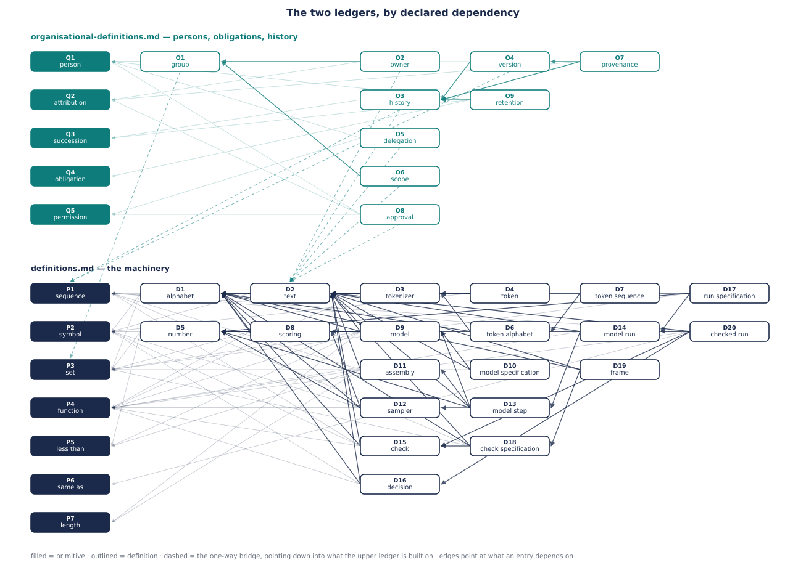

# Definitions

A ledger of definitions Pearu has approved as **complete**. Nothing enters this file
without his explicit approval, including primitives.

Candidates are argued in conversation; only approved ones are written down. The ledger is
built from first principles rather than from the whitepaper's vocabulary, so that the
whitepaper's terms can later be stated in it without presupposing themselves.

Governed by the rules, clarifications, and entry format of `../../RULES.md`. The clarification
below is specific to this study's subject matter.

---

## Clarifications specific to this study

**Hardware arithmetic is exact; approximation is a relation, not a defect.** An operation on
a finite set of numbers is a total, deterministic function — IEEE addition maps two floats to
exactly one float, and nothing about it is imprecise. What is approximate is the
*correspondence* between such a function and an intended one over the real numbers, and a
correspondence is a property of neither side. So (a+b)+c and a+(b+c) are two ordinary
functions that differ; they are not one function computed with error.

It follows that an algorithm on hardware is a function of the hardware and the implementation
as much as of its declared inputs. Two executions differing in number set or evaluation order
compute different functions — and by D9[model], different functions are different models.
Whether either answers a real-world question well is a separate matter, belonging to
validation rather than to definition.

---

## Notation

A **Notation** line restates an entry compactly. It is an aid and never the definition: where
the two disagree, the prose governs and the notation is wrong, since the sentence is what was
approved. Notation therefore takes no part in R5 re-verification. Not every entry has one —
an entry that is not a function often has no shorter form than its sentence.

Nine rows, each standing for something already in the ledger:

| symbol | meaning |
|---|---|
| `A`, `B`, `V` | alphabets — D1[alphabet] |
| `N` | a set of numbers — D5[number] |
| `A^*` | the texts over A, of any length — D2[text] |
| `A^≤L` | the texts over A whose length is at most L — P7[length], P5[less than] |
| `A^n` | the texts over A whose length is exactly n |
| `X → Y` | a function from X to Y — P4[function] |
| `X × Y` | the two-item sequences: first item in X, second in Y — P1[sequence], P3[set] |
| `⟨x, y⟩` | a sequence of the listed items — P1[sequence] |
| `[s]` | the text consisting of the single symbol s |

**Variable letters.** `t`, `f` a text · `s` a symbol · `n` a number · `d` a sequence of numbers.

Four rules of reading, which is where most such notation goes wrong. A fifth note records
what the notation deliberately leaves open.

**A function-valued argument or result is always parenthesised, and arrows never chain.**
`A^≤L → (A → N)` says a model returns a function; `(A → N) × N → A` says a sampler takes one.
Written as a bare chain these would be indistinguishable without an associativity convention,
and a reader would have to know which.

**`X × Y` is the set of two-item sequences — the prose's "together with", grounded.**
P1[sequence] restricts its items to nothing, so ⟨x, y⟩ with x from X and y from Y is already
an object of the ledger, and X × Y names the set of them (P3[set]); likewise X × Y × Z and
onward, and a function of two arguments is a function on X × Y. A tuple is a sequence used at
a fixed length; a pair is the two-item case; neither is a new kind of thing. An earlier
version of this paragraph read × as bare shorthand and predicted that a *pair* primitive would
be earned if the ledger ever had to reason about pairs — the need arrived with the
accountability entries, turned out to require nothing, and then dissolved: the one entry whose
value was a two-item sequence was replaced by a recursion that hands the parts back separately
(see the revision log). × remains as it is used: signature notation. For homogeneous X the reading agrees with the exponent:
X × X is X². One bracket serves every length: a value that is several things is written
⟨x, y⟩, never (x, y).

**A Notation line may name an intermediate value with a trailing *where*.** In
`f(t, d) = … where u = run(t, d)`, the name u is local to that line: an aid to reading
that introduces nothing and may not appear in the prose. The prose remains the definition.

**The exponent is one position with three fillings.** It says how long, and the three symbols
are three answers to that one question — exactly n, at most L, any:

```
A^2   =  A²                the texts of length exactly 2
A^≤2  =  A¹ ∪ A²           the texts of length at most 2, taken together
A^*   =  A¹ ∪ A² ∪ …       no bound
```

So `A^*` is not `A^≤L` with a decoration added, and `A^≤L` is not `A^*` with the star
mistakenly dropped: they are the same construction, differing in what fills the one position.
That is why the two never appear together. `(A^*)^*` does appear — in D11[assembly] — and says
something else entirely: the outer position counts *texts*, not symbols, so it reads *a
sequence of texts of any length*, which is precisely the argument an assembly takes.

`∪` is used only in this explanation and in no entry; read it as *taken together*.

**Where the run starts is not settled.** The lines above begin at `A¹` because that is as far
as P1[sequence] reaches: one item after another is plainly a sequence, zero items is not
plainly anything. No entry turns on the answer, so it stays open: if it is ever settled, each
line above gains `A⁰` — the set whose one member is the empty text — or does not, and nothing
else changes.

---

## Primitives

### P1 — sequence
**Assumed meaning.** Items, one after another; a single item, with nothing after it, counts.
**Why left undefined.** It is a primitive of ordinary counting and language. The formal
alternative — a map from positions to items — introduces two undefined terms (map, position)
and removes one.
**Added.** 2026-08-11

### P2 — symbol
**Assumed meaning.** A member of an agreed set, distinguishable from the other members. What
counts as one symbol is fixed by that set, not by how it appears: a symbol may be a letter,
part of a word, a whole word, or something with no ordinary name. The set decides the scale.
**Why left undefined.** Saying what the members are commits to a particular set — code
points, bytes, graphemes — and that commitment belongs to a deployment, not to this ledger.
**Added.** 2026-08-11 · **Revised.** 2026-08-11

### P3 — set
**Assumed meaning.** Items, with no order among them and none repeated.
**Why left undefined.** As with P1[sequence], the formal alternative — a membership relation with a
rule of extensionality — introduces more undefined terms than it removes.
**Added.** 2026-08-11
**Notes.** The wording settles neither edge. One item is a set by use —
D10[model specification] speaks of the set of models being a singleton. No items is left open,
exactly as the zero-item sequence is left open in the Notation section, and with as little at
stake: where the empty set acquires a reading downstream, the reading is benign — the
companion organisational ledger reads an empty group of owners as ownerlessness, saying in one
form what "no one stands behind the text" says in another.

### P4 — function
**Assumed meaning.** For each input, exactly one output. Where an entry says a function has
no value at an input, that input lies outside its domain.
**Why left undefined.** The formal alternative — a set of two-item sequences, no two sharing a
first item — is statable with P1[sequence] and P3[set]. The case rests on R2: "for each input,
exactly one output" is reliably the same idea for every reader; reasoning natively in sets of
two-item sequences is not.
**Added.** 2026-08-11
**Notes.** In practice an input outside the domain surfaces as an exception — the companion
script raises where the ledger says *no value*. The bare greatest-scored sampler is the
recorded example (D12[sampler] Notes), demoted from problem to non-example since ties can be
broken by the draw or, as practice does, by the token numbering; D20[checked run] is the one
entry irreducibly so. The alternative — totalizing by extending the codomain with a no-result
object, as IEEE does with NaN (D5[number] Notes) — was considered and declined: it changes
every consumer's type.

### P5 — less than
**Assumed meaning.** A comparison that, for any two items, answers whether the first is less
than the second.
**Why left undefined.** Making it a definition would still need `boolean` — a primitive to
remove a primitive, since two-item sequences already give the pair. And which properties the
answers have — transitivity, trichotomy — is a property of the particular set, not of what the
comparison means.
**Added.** 2026-08-11

### P6 — same as
**Assumed meaning.** That there is one thing, not two.
**Why left undefined.** Any definition either substitutes a synonym, which R8 forbids, or
introduces a relation with stated properties — several notions to remove one.
**Added.** 2026-08-11
**Notes.** This is reflexive: everything is the same as itself. A number system may define a
comparison spelled "equality" that is not — IEEE's fails on NaN. That comparison is a
different relation, not another name for this one, so it is deliberately *not* recorded as an
alternative name (R8).

### P7 — length
**Assumed meaning.** How many items a sequence has.
**Why left undefined.** Defining it requires counting — putting the items in correspondence
with numbers taken in order — which introduces correspondence to remove one notion. As with
P4[function], the case rests more on R2 than on cost: "how many items" is reliably the same idea for
every reader; a correspondence with an initial run of the numbers is not.
**Added.** 2026-08-11

---

## Definitions

### D1 — alphabet
**Definition.** A set of symbols.
**Notation.** `A`
**Depends on.** P2[symbol], P3[set]
**Added.** 2026-08-11 · **Renumbered.** 2026-08-11 (was D2)
**Also called.** *vocabulary*, in machine-learning writing and in the whitepaper's sources —
though its members are usually not words.
**Notes.** P2[symbol] refers to "an agreed set" without naming it; naming it makes it something later
definitions can refer to — the alphabet *of* a system. Since the set decides scale (P2[symbol]), the
same writing is a different text over a byte alphabet than over a word alphabet.

### D2 — text
**Given.** an alphabet A
**Definition.** A sequence of symbols from A.
**Notation.** `A^*`
**Depends on.** P1[sequence], P2[symbol], D1[alphabet]
**Added.** 2026-08-11 · **Revised.** 2026-08-11 · **Renumbered.** 2026-08-11 (was D1)
**Notes.** Whether "ä" is one symbol or two is a question about A, not about the text.

### D3 — tokenizer
**Given.** alphabets A and B
**Definition.** A function from texts over A to texts over B.
**Notation.** `A^* → B^*`
**Depends on.** D1[alphabet], D2[text], P4[function]
**Added.** 2026-08-11 · **Revised.** 2026-08-11
**Notes.** A text is *over* an alphabet when every symbol in it belongs to that alphabet. The
two alphabets are generally different: the input is whatever the source is written over, the
output is the tokenizer's own. This is where the question deferred at D2[text] is answered — a
tokenizer is what decides whether "ä" is one symbol or two, and different tokenizers decide
differently. Only the forward direction is defined: the map back, from token texts to the
writing they spell — the *decoder* — is deliberately left out, and becomes necessary the moment
one asks what a token stands for. Until then a token that looks like an input symbol is a
member of a different set that happens to share its glyph.

### D4 — token
**Given.** a tokenizer T
**Definition.** A symbol in the output alphabet of T.
**Notation.** `b ∈ B`, where B is the output alphabet of T
**Depends on.** P2[symbol], D1[alphabet], D3[tokenizer]
**Added.** 2026-08-11 · **Revised.** 2026-08-11
**Notes.** Not a new kind of thing — a symbol in a particular role. What it discriminates is
*which* alphabet: the same piece of writing is symbols of the input alphabet before the
tokenizer and tokens after it. The integer each token is numbered with is deliberately left
out; it becomes necessary only when "the same tokenizer" has to be defined, since two
tokenizers can agree on every piece of writing and disagree on the numbering.

### D5 — number
**Definition.** A symbol in a set on which "less than" is defined.
**Notation.** `n ∈ N`
**Depends on.** P2[symbol], P3[set], P5[less than]
**Added.** 2026-08-11
**Notes.** The comparison always answers; what varies is whether the answers arrange the
members in a single order. Such a set generally contains members that are not quantities,
present so that arithmetic is total — in IEEE floating point 5/0 gives an infinity and 0/0
gives NaN. The two behave differently: an infinity takes its place in the order normally,
while NaN answers "no" in both directions and is not equal even to itself, so it sits in the
set with no place in the order at all.

### D6 — token alphabet
**Given.** a tokenizer T
**Definition.** The output alphabet of T.
**Notation.** `B`, where `T : A^* → B^*`
**Depends on.** D1[alphabet], D3[tokenizer]
**Added.** 2026-08-11 · **Revised.** 2026-08-11
**Notes.** Its members are exactly the tokens (D4[token]). Naming it makes "a text over a token
alphabet" sayable in one phrase — which is what a D9[model] takes as input and what its
output function ranges over, the same alphabet on both sides.

### D7 — token sequence
**Given.** a tokenizer T
**Definition.** A text over the token alphabet of T.
**Notation.** `B^*`
**Depends on.** D2[text], D6[token alphabet]
**Added.** 2026-08-11 · **Revised.** 2026-08-11
**Notes.** Completes the pattern: a token sequence is to a token alphabet what a text is to
an alphabet, and a token is to a token alphabet what a symbol is to an alphabet.

### D8 — scoring
**Given.** an alphabet A, and a set N of numbers
**Definition.** A function from A to N.
**Notation.** `A → N`
**Depends on.** D1[alphabet], D5[number], P3[set], P4[function]
**Added.** 2026-08-11
**Notes.** In practice a scoring is what a D9[model] produces: applied to a text, a model
gives one. Total on A by P4[function] — every symbol gets a number, not a chosen few. Nothing
constrains the values: they may be negative, may repeat, and may be incomparable where the
number set admits such members. A scoring induces a ranking of A through the ordering of its
values, but that ranking need not have a greatest element — an incomparable value, or an
alphabet with no largest, leaves the greatest undefined.

### D9 — model
**Given.** an alphabet A, a set N of numbers, and a bound L on length
**Definition.** A function from texts over A whose length is at most L, to scorings over A
into N.
**Notation.** `M : A^≤L → (A → N)`
**Depends on.** D1[alphabet], D2[text], D5[number], D8[scoring], P3[set], P4[function],
P5[less than], P7[length]
**Added.** 2026-08-11
**Notes.** The same A on both sides is what lets generation repeat: a symbol taken from the
output belongs to A, so it can be appended to the input. In deployment A is a
D6[token alphabet], and L differs in origin — in implementation terms, none of them defined
here: with *learned position parameters* the bound sits in the stored arrays, with *computed
positions* it is a declared setting. A model is in practice
tied to one D3[tokenizer], but that tie rests on the numbering of tokens, which D4[token]
leaves out; it becomes statable once numbering is defined.

### D10 — model specification
**Definition.** A text that determines a set of models.
**Depends on.** D2[text], D9[model], P3[set]
**Added.** 2026-08-11
**Notes.** In practice — implementation terms, not defined here — an *architecture*,
*parameters* and a *configuration*, together with a D3[tokenizer]: the things that can be
written into files and shipped. What they do not fix is which member of the set an
execution computes; that depends on the machine, and no file can carry it. The set is a
singleton only if the number set and evaluation order are pinned too, which specifications do
not do. "Open weights" delivers a specification, not a model.

### D11 — assembly
**Given.** an alphabet A, and a bound L on length
**Definition.** A function from a sequence of texts over A to one text over A whose length is
at most L.
**Notation.** `asm : (A^*)^* → A^≤L`
**Depends on.** D2[text], P1[sequence], P4[function], P5[less than], P7[length]
**Added.** 2026-08-11
**Notes.** Generation is repeated assembly: each step takes the current text together with the
newly chosen symbol as a text of length one, and produces the next, so the cycle is one
assembly applied over and over. That lift is not optional — an assembly takes texts and a
sampler gives a symbol (D13[model step]). Two consequences. Boundaries between the given texts do not survive — a sequence of texts records
where each begins and ends, a single text does not, so any distinction that outlasts assembly
does so only because delimiter symbols were written into the content. And when the given texts
together exceed L, some of their content has no representation in the result, while the result
records nothing about what was dropped. Which parts are dropped is what distinguishes one
assembly from another; they are different functions, not one function configured differently.

### D12 — sampler
**Given.** an alphabet A
**Definition.** A function from a scoring over A together with a number, to a symbol in A.
**Notation.** `S : (A → N) × N → A`
**Depends on.** D1[alphabet], D5[number], D8[scoring], P2[symbol], P4[function]
**Added.** 2026-08-11
**Notes.** The second input is the *draw*. The sampler is deterministic: the same scoring and
the same draw always give the same symbol. Randomness does not live in the function but in
where the draws come from, so "random sampling" is a deterministic function applied to a
varying input — and declaring the draw is what turns randomness from an unstateable property
of a component into a recordable input. Which numbers a sampler accepts is a property of the
particular sampler: one draw suits the common method, while others consume one per symbol.
Since a scoring need not have a greatest-valued symbol, a sampler that returns one is a
function only where such a symbol exists. This is also where output stops being comparable
within a tolerance: two symbols are the same or they are not, with no notion of *nearly*,
which is why variation negligible in a scoring is not negligible here.

### D13 — model step
**Given.** a model M over alphabet A with bound L, a sampler S over A, and an assembly over A
with that same bound L
**Definition.** A function from a text over A of length at most L together with a number, to a
text over A of length at most L: apply M to the text, apply S to the resulting scoring and the
number, and apply the assembly to the text and the one-symbol text formed from the symbol S
gives.
**Notation.** `step : A^≤L × N → A^≤L`, with
`step(t, n) = asm( ⟨ t, [ S(M(t), n) ] ⟩ )`
**Depends on.** D2[text], D5[number], D9[model], D11[assembly], D12[sampler], P4[function]
**Added.** 2026-08-11
**Also called.** *generation step*, in industry usage and formerly here — renamed because the
definition does not guarantee generation; what it guarantees is that a model is consulted.
**Notes.** The Given carries the condition that makes the composition work: the **same L**
throughout. An assembly with a larger bound could produce a text the model does not accept,
and the step would have no result. The symbol must be lifted to a text of length one, since an
assembly takes texts and a sampler gives a symbol. No tokenizer appears — D3[tokenizer] is
upstream, getting writing into A in the first place, and takes no part once the loop is
running. The number is the draw; a step is therefore deterministic, and so is any sequence of
steps given the draws.

### D14 — model run
**Given.** a model M, a sampler S, and an assembly, all over an alphabet A with the same bound L
**Definition.** A function from a text over A of length at most L together with a sequence of
numbers, to a text over A of length at most L: apply the model step to the text and the
first number, then to that result and the second number, and so on; the result is the text
given by the step taking the last number.
**Notation.** `run : A^≤L × N^* → A^≤L`, with
`run(t, ⟨n⟩) = step(t, n)` and `run(t, ⟨n₁, …, n_k⟩) = run( step(t, n₁), ⟨n₂, …, n_k⟩ )`
**Depends on.** D2[text], D5[number], D13[model step], P1[sequence], P4[function]
**Added.** 2026-08-11
**Also called.** *generation run*; the industry's *text generation* is a model run whose
assembly keeps the chosen symbols.
**Notes.** The length of the draw sequence is the number of steps, so no stopping condition
appears. A rule for stopping — halt when a particular symbol is chosen — would need only that
symbol named in the Given and P6[same as] to test for it; it is not owed here, since a run
that stopped after k steps has the same value as a run given k draws. What is missing is only
the rule that chose k. The recursion bottoms out at one draw rather than none, which keeps it
clear of the question left open in the Notation section. N is a set of symbols and so an
alphabet by D1[alphabet], which makes a sequence of draws a text and `N^*` the same
construction as `A^*`. A run is fixed by exactly four things: the three components, the
starting text, and the draws — and by the Clarification on hardware arithmetic, the numeric
regime is not a fifth, since changing it changes which model M is. Nothing is carried between
steps except the text, so a run has no state of its own.

### D15 — check
**Given.** alphabets A and V
**Definition.** A function from a sequence of texts over A to a symbol in V.
**Notation.** `chk : (A^*)^* → V`
**Depends on.** D1[alphabet], D2[text], P1[sequence], P2[symbol], P4[function]
**Added.** 2026-08-12
**Notes.** The argument is a sequence of texts rather than one text because a check that
compares outputs produced independently has to tell them apart, and D11[assembly] records that
boundaries do not survive assembly — an assembled text could not support such a comparison. A
check on a single text is the one-element case. V is unconstrained: it may have two members, it
may be a set of categories, and it may be a set of numbers, since D5[number] makes a number a
symbol and a set of them an alphabet by D1[alphabet] — so a verdict carrying a magnitude, and a
later comparison of it against a threshold, need no extension. No bound on length appears,
because nothing here feeds a model; this is the first entry since D8[scoring] free of L. When a
check runs is not a property of the check: the whitepaper's Guards are described as running
before, during, or after work, and that is a property of whatever calls them. The name is
provisional — "check" suggests a two-valued result, which V does not require; it is worth
revisiting once something consumes verdicts.

### D16 — decision
**Given.** alphabets V and C
**Definition.** A function from texts over V to symbols in C.
**Notation.** `dec : V^* → C`
**Depends on.** D1[alphabet], D2[text], P2[symbol], P4[function]
**Added.** 2026-08-12
**Notes.** The same shape as D15[check], one level down: a check reduces a sequence of texts to
one symbol, a decision reduces a sequence of symbols to one symbol. The types differ — `(A^*)^*`
against `V^*` — but a symbol lifts to a one-symbol text as in D13[model step], so the two
are the same kind of object. What earns the entry is composition rather than type: the chain
from texts to a verdict to an action cannot be stated without naming both links. That the two
links coincide in shape is a finding, not a defect — this layer is one operation applied twice.
Nothing mechanical distinguishes C from V; which alphabet holds verdicts and which holds actions
is fixed by position in the chain, not by any property here. Where V is a set of numbers a
decision can compare against a threshold, by P5[less than]. Verdicts are not named separately:
a sequence of them is a text over V by D2[text], so D16 needs no entry for one, though
D4[token] shows the shape such an entry would take if something later wants it.

### D17 — run specification
**Given.** an alphabet A, and a bound L on length
**Definition.** A text that determines three things: a set of model runs; a text over A
whose length is at most L; and a sequence of numbers.
**Depends on.** D2[text], D5[number], D14[model run], P1[sequence], P3[set]
**Added.** 2026-08-12
**Notes.** No Notation line, for the reason D10[model specification] has none: it is a text, and
its content is what it determines, which no type expresses. By D14[model run] a run is
fixed by its three components together with the starting text and the draws, so those five are
what such a text must hold. Two of them it can hold exactly, being texts themselves — the
starting text, and the draws, since a sequence of numbers is a text over an alphabet of numbers.
The components it cannot: one of them is a model, and by D10[model specification] a text
determines only a set of models. So the set here is never a singleton, and writing more into
the text does not narrow it. The limit is D10's and not a matter of thoroughness. Nothing here
records *when* the text was written, so a text composed before the work and one composed after
it are the same kind of object — which is why this is not named for the backward-looking case.
Verdicts are left out: a check's results would extend what is determined, and the extension is
worth making once something consumes a recorded verdict rather than before.

### D18 — check specification
**Given.** alphabets A and V
**Definition.** A text that determines a set of sequences of checks over A and V.
**Depends on.** D1[alphabet], D2[text], D15[check], P1[sequence], P3[set]
**Added.** 2026-08-12
**Notes.** No Notation line, for the reason D10[model specification] has none. The checks are
determined as a sequence rather than a set because D16[decision] takes a text over V, which is
ordered: were they unordered, a caller would have to impose an order, and the same specification
could then yield different verdict sequences and so different actions. What is determined is a
*set* of sequences rather than one, because a check is a function and a text cannot determine a
function — D10[model specification]'s limit, applying here for two separate reasons. A check may
itself use a model, in which case D10 applies directly; and a check that uses none is still
underdetermined, since by the Clarification on hardware arithmetic two executions differing in
evaluation order compute different functions, hence different checks. A shipped check, like a
shipped model, is therefore a specification and not a thing. Where in a larger structure the
checks run is not fixed here — that needs something that calls them, and this says only which
checks and in what order.

### D19 — frame
**Given.** alphabets A and V
**Definition.** A check specification over A and V that is itself a text over A.
**Depends on.** D1[alphabet], D2[text], D18[check specification]
**Added.** 2026-08-12
**Notes.** No Notation line, for the reason D10[model specification] has none. The content is
in "over A": a check specification's own alphabet is otherwise free — a file of bytes will do —
but this one is over the model's alphabet, so it is the one artifact that can both enter a
model's input, being assemblable by D11[assembly], and declare what checks the output. That is
the mechanically visible part of the whitepaper's Frame — an outside term: what it adds (scope,
inheritance, ownership, versioning, shareability, discoverability) is organisational and finds
no expression here. A text over A that declares no checks is not a frame under this definition
but merely a text — the reading chosen deliberately, since the alternative, a frame declaring
"the checks: none", would need the empty sequence, which P1[sequence] leaves open. And entering
the input buys no force: by D8[scoring] no text can make any symbol unreachable, and by
D11[assembly] nothing guarantees a text survives assembly. What a frame changes mechanically is
which checks must pass, not what the model does.

### D20 — checked run
**Given.** a model M, a sampler S, and an assembly, all over an alphabet A with the same bound
L; checks c₁, …, c_m over A and V, in that order; a decision dec over V and C; and two symbols
in C, the accept and the refuse
**Definition.** A function from a text over A of length at most L together with a sequence of
sequences of numbers, to a text over A of length at most L. For the first given sequence:
apply the model run to the text and it; apply each of c₁, …, c_m to the two texts, the given
one and the run's; apply dec to the sequence of their verdicts, taken in the checks' order. If
the symbol dec gives is the same as the accept, the value is the run's text; if the same as
the refuse, there is no value; otherwise the value is that of the checked run at the same text
and the remaining sequences — and where no sequence remains, there is no value.
**Notation.** `op : A^≤L × (N^*)^* → A^≤L`, with
`op(t, ⟨d₁, …, d_k⟩) = u` if `dec( ⟨ c₁(⟨t, u⟩), …, c_m(⟨t, u⟩) ⟩ )` is the accept, no value
if it is the refuse, and otherwise `op(t, ⟨d₂, …, d_k⟩)` — `where u = run(t, d₁)`
**Depends on.** D2[text], D5[number], D14[model run], D15[check], D16[decision], P1[sequence],
P2[symbol], P4[function], P6[same as]
**Added.** 2026-08-12
**Also called.** *Op*, in the whitepaper — which adds versioning, installation, tools,
integration logic, and human roles, none of them expressible here.
**Notes.** The recursion mirrors D14[model run]'s: one draw-sequence is consumed per level,
and the last level's otherwise-case is answered directly — where no sequence remains, there
is no value — so the empty sequence is never formed, clear of the zero-item question. The
accepting level hands the run's text back directly, which is why no value here holds two
things. Each check receives the two texts ⟨t, u⟩ with their boundary intact, which by
D15[check]'s design is what lets a check compare an output against its source; the verdicts
are taken in the checks' declared order — the order D18[check specification] declares and
D16[decision]'s input carries; at least one check, consistent with D19[frame]'s reading that
declaring no checks is not a declaration. Partial three ways: no value where a level's symbol
is the refuse — the honest reading of the whitepaper's *stop*, whose "and escalate" half is
organisational; no value where the sequences run out unaccepted, so the draws are the retry
budget; and no value wherever the run has none — a greatest-scored sampler facing a tie, say.
The whitepaper's seven Gate actions reduce here to three mechanical roles: *continue* is the
accept, *stop* is the refuse, and pause, request human approval, escalate to an expert, retry,
and run more validation are all *the next level*, differing only in who or what acts before
it — a difference this function cannot see. A human enters only as an input, never as a
check: by P4[function] a check gives one verdict per input, and a person does not; where
approval is wanted it arrives the way draws do, from outside, and is consumed as data. The
whitepaper's pre-flight stage is a check on ⟨t⟩ before any level; in-flight is this
construction wrapped at D13[model step] grain instead of D14[model run]; post-run is this
entry — one construction at three grains. The halt symbols are named in the Given and tested
with P6[same as]: the device D14[model run]'s Note once claimed required a predicate.

---

## Examples

Everything here is commentary: an example is never usable in a definition and takes no part in
R5. What separates examples from Notes is that they are **checkable** — every claim below
computes by hand from the definitions alone, and a claim that fails to compute is wrong, not
loose. The companion script `examples.py` holds the same system with every claim as an
assertion; the definitions govern both, and a disagreement between section and script means one
of the two has an error.

One system is used throughout, small enough to track by hand and free of any interpretation
beyond symbols and numbers. Texts are written by juxtaposition: `aBa` for the sequence a, B, a.

**The running system.**

| object | value |
|---|---|
| input alphabet | A₀ = {a, b, ä} — D1[alphabet] |
| tokenizer T | a ↦ a, b ↦ B, ä ↦ aB — D3[tokenizer] |
| token alphabet | A = {a, B} — D6[token alphabet] |
| numbers | N = {0, 1, 2}, ordered 0 < 1 < 2 — D5[number] |
| bound | L = 3 |
| model M | score 1 to the symbol opposite the last symbol of the text, 0 to the other — D9[model] |
| sampler S | draw 0 takes the greatest-scored symbol, draw 1 the least — D12[sampler] |
| assembly asm | concatenate the given texts in order, keep the last 3 symbols — D11[assembly] |
| checks, V = {ok, no} | nodouble: ok iff no text has two equal adjacent symbols · agree: ok iff all texts are the same — D15[check] |
| decision dec, C = {go, review, drop} | review iff any verdict is no, else go; no dec here ever gives drop — D16[decision] |

The primitives are exhibited by the objects themselves: `aBa` is a sequence (P1[sequence]) of
symbols (P2[symbol]); A is a set (P3[set]); M is a function (P4[function]); 0 < 1 in N
(P5[less than]); a run computed twice is one text, not two (P6[same as]); the length of `BaB`
is 3 (P7[length]).

**Tokenization.** `äa` is a text of length 2 over A₀; T(äa) = `aBa`, a D7[token sequence] of
length 3 whose symbols are D4[token]s. Whether ä is one symbol or two is answered by T, not by
the writing — D2[text]'s deferred question, computed. The two alphabets share the member a and
differ in the rest, deliberately: D3[tokenizer] requires no relation between them in either
direction, and even the shared a is two set-memberships that only a decoder could identify —
the map back, from token texts to the writing they spell, which D3[tokenizer]'s Notes record as
left out. Practice also differs from this toy in the direction of scale: a deployed token
typically spells *several* input symbols, where T here spells ä with two tokens.

**In practice: the numbering.** Implementations attach to each token an integer — here a ↦ 0,
B ↦ 1, a bijection from A to {0, 1}. The tokens stay symbols; the structure lives in the
numbering, which is how a function from A materializes as an array: the scoring a ↦ 1, B ↦ 0
becomes [1, 0] by scoring ∘ numbering⁻¹, and such arrays are what a deployed model emits. The
bijection is the deferred content of D4[token]: the second numbering a ↦ 1, B ↦ 0 leaves T
agreeing on every text while every array changes — why "the same tokenizer" cannot be defined
until the numbering is (D4[token] and D9[model] Notes). Writing A itself as {0, 1} would
instead give the tokens order and arithmetic that nothing in the entries consumes, and would
collide with the draws, which really are numbers.

**One step.** step(aB, 0): M(aB) is the D8[scoring] a ↦ 1, B ↦ 0, since the last symbol is B;
S picks a; asm(aB, [a]) = `aBa` (D13[model step]).

**A run, and forgetting.** run(aB, ⟨0, 0⟩): aB → aBa → aBaB clipped to `BaB`. The starting a is
gone and BaB records nothing about it — D11[assembly]'s overflow consequence, in two steps
(D14[model run]).

**The draw is an input.** run(aB, ⟨0⟩) = `aBa` but run(aB, ⟨1⟩) = `aBB`: same components, same
start, different draw, different text. Repeating either gives the same text again — the
randomness is in the draws, never in the functions (D12[sampler]).

**Why a check takes a sequence of texts.** agree(⟨aBa, aBB⟩) = no and agree(⟨aBB, aBB⟩) = ok,
yet asm(⟨aBa, aBB⟩) = asm(⟨aBB, aBB⟩) = `aBB`. Two sequences with different verdicts assemble
to the same text, so no check on the assembled text computes agreement. This is a two-line
proof of D15[check]'s design, not an illustration.

**The chain, end to end.** Two runs disagree: r₀ = run(aB, ⟨0⟩) = `aBa`, r₁ = run(aB, ⟨1⟩) =
`aBB`. Verdicts: nodouble(⟨r₀⟩) = ok, nodouble(⟨r₁⟩) = no, agree(⟨r₀, r₁⟩) = no. Decision:
dec(⟨ok, no, no⟩) = review. Texts reduced to a verdict text, reduced to an action — the
whitepaper's accountability plane, trackable on one hand (D15[check], D16[decision]).

**Specifications determine by convention.** The sentence *"score 1 to the symbol opposite the
last symbol, 0 to the other"* is a text; under the reading conventions of English and exact
arithmetic it determines M — a singleton, because the toy states everything, which
D10[model specification]'s Notes record practice never does. Weakened to *"score the opposite
of the last symbol higher"*, it determines at least three models over N — score pairs (1, 0),
(2, 0), (2, 1) — a set, visibly. *"Components as above; start aB; draws 0, 0"* is a
D17[run specification]: what it pins exactly are the start and the draws, and replaying gives
`BaB` again. *"Run nodouble, then agree"* is a D18[check specification]. In every case what
makes the text a specification is an agreed reading, and the reading lives outside the ledger —
the toy makes that visible because its conventions had to be stated.

**A frame, and its limits.** Adopt the reading: a text over A beginning `Ba` declares
⟨nodouble⟩. Then `Ba` is a D19[frame] — it can enter a model's input *and* it obliges a check.
But asm(⟨Ba, aB⟩) = BaaB clipped to `aaB`, which no longer begins Ba: the frame entered the
input and did not survive it, so the declaration is readable only before assembly. The
obligation still discharges on the output — run(aaB, ⟨0⟩) = `aBa`, nodouble(⟨aBa⟩) = ok — which
is D19's closing sentence made concrete: a frame's force is in the checks owed, not in what the
model does.

**Non-examples.** Three degenerate cases fence the meanings. The constant scoring a ↦ 0, B ↦ 0
has no greatest-scored symbol, so S has no value there — D12[sampler]'s partiality, not an
error in it. The assembly that keeps only its first given text yields a model step with
step₀(t, n) = t for every t: it consults M, samples, and changes nothing — why D13[model step]
is not named *generation step*. And M has no value on the empty text, having no last symbol to
read; whether the empty text is in A^≤L at all is the Notation section's open question, and the
system runs entirely on lengths 1 to 3 without ever needing the answer.

**The textbook's model, specialized.** The standard textbook language model is a bigram count.
Fix the corpus `aBaa` and score each symbol by how often it followed the last symbol of the
input, in that corpus: a D9[model] with values already in N. M_c(Ba) is the scoring a ↦ 1,
B ↦ 1, since after a the corpus continues once with a and once with B; M_c(aB) is a ↦ 1,
B ↦ 0. The first is exactly the tie on which S has no value — and the textbook sampler exists
for this case: it splits the draw range in proportion to the scores, here by table,
S_p(⟨a ↦ 1, B ↦ 1⟩, 0) = a and S_p(⟨a ↦ 1, B ↦ 1⟩, 1) = B — a D12[sampler], unmodified, whose
value on a tie comes from the draw. *Probability* is the outside name for the proportions
behind that table; the table itself needs no arithmetic to check. The textbook's draw is a
number u between 0 and 1, of which the draws {0, 1} are the coarsest version — and u is what
implementations log, or fail to log, when they speak of seeds. The definitions stay general;
the example specializes.

**A checked run.** The checked run of the running components with the single check nodouble,
go as the accept and drop as the refuse: op(aB, ⟨⟨1⟩, ⟨0⟩⟩) = aBa (D20[checked run]). By hand:
at the first level run(aB, ⟨1⟩) = aBB, nodouble(⟨aB, aBB⟩) = no for the doubled B, and dec
gives review — neither the accept nor the refuse, so the recursion continues at ⟨⟨0⟩⟩; there
run(aB, ⟨0⟩) = aBa, nodouble gives ok, dec gives go, and aBa is handed back. The sequence of
draw-sequences is thereby the retry budget: op(aB, ⟨⟨1⟩⟩) has no value, nothing having been
accepted. Under the stricter decision dec_p, which gives drop on any no, op_p(aB, ⟨⟨1⟩, ⟨0⟩⟩)
has no value either, although its second level alone would have been accepted: an early refuse
is final. The whitepaper's *continue*, *stop*, and everything else are visible here as go,
drop, and review — and review does nothing except let the recursion continue, which is the
three-role reduction of D20[checked run]'s Notes, computed.


---

## Figure



*Generated from the ledgers by `../../tools/make_graphs.py`; regenerate after any change.*

---

## Revision log

Every change to an existing entry under R5, with the re-verification result — accepted
changes and rejected ones alike. Rejections are kept with their failure reports so a later
attempt does not rediscover the same contradiction.

### 2026-08-12 — migrated to the hypelysis repository — **accepted**

**Change.** The rules R1–R10, the generic clarifications, and the entry format moved to the
repository-level `../../RULES.md`, where every study's ledgers share them; this file keeps the
clarification specific to its subject matter (hardware arithmetic) and gains a Figure section.
R4's approver is named generically there ("the study owner") and concretely here: Pearu. No
rule, clarification, or entry changed meaning — only where they live.

**R5/R7.** Structural, not semantic; every entry re-reads unchanged against the same rules at
their new address. **Passes.**

### 2026-08-12 — D8/D9: the number set named in the Given — **accepted** (R9)

**Change.** D8[scoring] read "a function from A to numbers", naming no number set: as written
a single scoring could score one symbol in IEEE floats and another in integers, leaving
"greatest-scored" not partial but meaningless, since P5[less than] is per-set. The parameter
was silently carried — R9's defect exactly — and the Notation already knew the answer:
`A → N`. D8's Given now carries a set N of numbers and its definition reads "a function from
A to N"; D9[model]'s Given carries N likewise, producing scorings over A into N — naming the
parameter the Clarification on hardware arithmetic always said a model fixes: changing the
number set is changing the model. D12[sampler] stands as written: it takes a scoring whatever
its N, its comparisons live inside that scoring's set, and the draw's set remains the
particular sampler's business. Surfaced by the are-you-sure audit; the first correction where
prose caught up to notation rather than the reverse.

**R5/R7.** D8 and D9 mean what every use already assumed — one number set per scoring, fixed
by the model. D10–D20 re-read cleanly; the Examples' single N = {0, 1, 2} complies.
**Passes.**

### 2026-08-12 — P4[function]: no-value inputs lie outside the domain — **accepted**

**Change.** Entries said "no value" (D12[sampler]'s bare greatest-scored rule,
D20[checked run] three ways) while P4 promised exactly one output per input, patched per-entry
in Notes. P4 now says it once, with the practical rendering recorded — such inputs surface as
exceptions — and the declined alternative noted: totalizing IEEE-style with a no-result object
in the codomain, at the cost of every consumer's type. Audit outcome alongside: the partial
greatest-sampler is a property of that bare rule, not of D12[sampler] — ties break by the draw
or by the token numbering in practice — leaving D20[checked run] the one irreducibly partial
entry.

**R5/R7.** No meaning changed; the clause states once what Notes said locally, and
D12/D13/D14/D20 re-read cleanly against it. **Passes.**

### 2026-08-12 — P1[sequence] covers the single item explicitly — **accepted**

**Change.** "Items, one after another" left the one-item case to charity: a single item has
nothing after it, yet `[s]` — the lift in D13[model step] — and D14[model run]'s recursion
base stand on it. The assumed meaning now adds: a single item, with nothing after it, counts.
Surfaced by the systematic are-you-sure audit; the zero-item case remains open as recorded in
the Notation section.

**R5/R7.** A clarification of what every entry already relied on, not a change of meaning;
one-item sequences appear throughout D13, D14 and the Examples and confirm rather than
contradict. **Passes.**

### 2026-08-12 — P3[set] Notes added: the edges of "items" — **accepted**

**Change.** P3[set] gained a Note recording what its wording does and does not settle: one
item is a set by use (D10[model specification]'s singletons); no items is open, in parallel
with the zero-item sequence recorded in the Notation section. Prompted by the companion
organisational ledger, where "a group, each of whose members stands behind t" is vacuously
satisfied by a group of none — first read as a hazard, then correctly as a reading: an empty
owner is ownerlessness. No entry in either ledger presses the question toward settlement. The
companion ledger is named without a bracket citation, keeping the bridge one-way.

**R5/R7.** A Note is commentary; P3's assumed meaning is unchanged and nothing re-verifies.
**Passes.**

### 2026-08-12 — `round` removed; `checked run` renumbered D21→D20, restated recursively — **accepted**

**Change.** The entry `round` is removed — the first removal of an approved entry — and
`checked run` takes its number, restated as a recursion on the given sequences in the pattern
of D14[model run]. `round` existed to split one dense definition into two readable ones; the
recursion achieves the readability without the auxiliary concept, and removes with it the only
value that held two things. The pair was transport, not content: it packaged the run's text
past a search boundary that the recursion does not have — the accepting level returns the text
directly. A concept whose only consumer inlines it was scaffolding. If a per-level record ever
earns a place — a Track holding verdicts round by round is the plausible trigger — this log
knows where to look.

**Consequences.** The × paragraph retold (its grounding stands; the value-level use is gone);
the where-device example updated; the Examples paragraph and the companion script rewritten
around the checked run alone, the loop with the early return being the recursion's iterative
rendering. References to `checked run` now read D20[checked run]; mentions of the removed
entry in this log are de-bracketed, naming what no longer exists.

**R5/R7.** `checked run` computes the same function, restated; nothing else depended on
`round`. Headings, brackets, numbering, field order and Examples coverage re-verified.
**Passes.**

### 2026-08-12 — D21 Notation side-condition rewritten — **accepted**

**Change.** The line read *"d_j the first at which the second item is the accept, none earlier
the refuse"* — an ellipsis that swallowed its verb and subject. It now uses the equivalent
neither-nor form: the second item at d_j is the accept, and at every earlier given sequence it
is neither the accept nor the refuse. Equivalent because d_j being the *first* accept already
makes the earlier items non-accepts; the proviso adds non-refuse; together, neither. A reading
aid that needs decoding is a defect in the aid.

**R5/R7.** Notation governs nothing; the prose Definition is unchanged. **Passes.**

### 2026-08-12 — two-item sequences ground `×`; P4/P5 justifications amended; D14 Note corrected — **accepted**

**Change.** Proposing `round` — then numbered D20, since removed; see above — raised the need for a value holding two things, and a *pair*
primitive was drafted — then withdrawn as what would have been the ledger's first redundant
primitive: P1[sequence] restricts its items to nothing, so ⟨x, y⟩ was available all along, and
a tuple is a sequence used at a fixed length. `X × Y` now names the set of two-item sequences,
which every existing signature already reads as; a *where*-device for Notation lines is
declared rather than smuggled. Two justifications amended for honesty: P4[function]'s formal
alternative is statable with two-item sequences, so its case now rests wholly on R2;
P5[less than] would still need only `boolean`. And D14[model run]'s Note claimed a stopping
rule "needs a predicate" — it needs a Given-named symbol and P6[same as], as D20[checked run]
demonstrates; D14 remains right that no stopping rule was owed there.

**R5/R7.** No definition or primitive changed meaning — justification lines and commentary
moved; Notation governs nothing. Nothing depends on the amended texts. **Passes.**

### 2026-08-12 — token alphabet recased in the Examples; decoder deferral recorded — **accepted**

**Change.** The running system's token alphabet was {a, b} against the input alphabet
{a, b, ä} — a subset, every token a glyph the input already had, and the toy tokenizer
expanding where deployed ones compress. All accidents D3[tokenizer] does not require, and the
toy was calibrating exactly the wrong intuition — the question "is the token alphabet a subset
of the input alphabet?" was asked from it. The token alphabet is now A = {a, B}: one member
shared with A₀, one not, no inclusion in either direction. Every computation renames b → B and
nothing else changes. Alongside it, D3[tokenizer]'s Notes now record the *decoder* deferral:
only the forward direction is defined, and the map back — what a token spells — is left out
with its trigger stated.

**R5/R7.** Examples and Notes are commentary; no definition changed. The companion script runs
clean after the rename. **Passes.**

### 2026-08-12 — Examples section and companion script added — **accepted**

**Change.** A section materializing every entry in one running system — A = {a, b}, L = 3, a
one-sentence model, a greatest/least sampler, a keep-the-last-3 assembly, two checks, one
decision — small enough that every claim computes by hand. Non-examples fence the meanings: the
tie scoring where the sampler has no value, the assembly that makes a model step change
nothing, the two check-sequences that assemble to the same text. The companion `examples.py`
holds the same system with every claim as an assertion and runs clean.

**Status.** Examples are commentary: never usable in a definition, no part in R5. Unlike Notes
they are checkable — a claim that does not compute is wrong. The definitions govern both the
section and the script; a disagreement between those two means one of them has an error.

**R5/R7.** No definition changed. **Passes.**

### 2026-08-12 — `generation step`/`generation run` renamed to `model step`/`model run` — **accepted**

**Change.** D13 and D14 are now named for what their definitions guarantee — a model is
consulted — rather than for what common assemblies do with the result. Nothing in D13 requires
the sampled symbol to survive the assembly: D11[assembly] admits a function that ignores its
second argument, giving a step that consults the model and returns its input unchanged — a
"generation step" that generates nothing. Defining generation properly would need containment
of one text in another, machinery the ledger does not have, and the property would belong to
the assembly rather than the step. The industry's word is kept as **Also called** on both
entries, since it is how the whitepaper and practice speak.

**Scope.** Bracketed references updated throughout, including in this log, so the
heading-and-bracket check stays clean; bare mentions of the old names in earlier log entries
are history and stay. Ordinary-language uses of "generation" in the Notes of D9[model] and
D11[assembly] describe practice, not the renamed entries, and stay.

**R5/R7.** Names moved; no definition changed meaning. **Passes.**

### 2026-08-12 — D17 definition reworded — **accepted**

**Change.** The definition read *"determines a set of generation runs, a text over A whose
length is at most L, and a sequence of numbers"* — whose natural parse is one set containing
three kinds of things. It now reads *"determines three things:"* with the three separated by
semicolons. The Notes already carried the intended reading, but a definition should not need
its Notes to parse.

**R5/R7.** No meaning changed — the sentence now says unambiguously what it was approved as
saying. The only subsequent entry, D18[check specification], does not reference
D17[run specification]. **Passes.**

### 2026-08-11 — D11 Note repaired; four counts and cross-references corrected — **accepted**

**Change.** D11[assembly]'s Note said *each step takes the current text and the newly chosen
symbol* — the very error the notation exposed in D13[model step]. An assembly takes texts;
the symbol must be lifted to a text of length one. The Note now says so and cites D13. Until
this fix the ledger stated the wrong thing in one place and the right thing in another.

**Four bookkeeping corrections alongside it.** The Notation section claimed *seven symbols*
against a nine-row table, and *two rules of reading* against three rules and a note — both
counts were correct when written and were not updated as rows and rules were added. The Entry
format block listed **Notation** after **Added** while every entry carries it before **Depends
on**. And the `A*`→`A^*` log entry pointed at its own revision as *immediately below* when a
later insertion had moved that revision above it.

**What this locates.** All five defects are in prose *about* the ledger — counts, a template, a
cross-reference, a stale Note — and none in a definition. Entries are protected by R4 approval
and by the heading-and-bracket checks; the connective tissue is protected by neither, and it is
what rotted. The mechanical check should grow to cover field order and the stated counts.

**R5/R7.** A Note is commentary and governs nothing, so no definition changed and no
re-verification was owed. Recorded because it is a correction, not a tidy. **Passes.**

### 2026-08-11 — Kleene dropped from the Notation section — **accepted**

**Change.** The Notation section named Kleene as the source of the star, to pre-empt a reader
importing his `A⁰` reflexively. Once the display was corrected to read `A^* = A¹ ∪ A² ∪ …`
(entry below), it says so directly and the appeal became dead weight. The open question stands
without him: *P1[sequence] does not say whether zero items is a sequence* is a statement about
this ledger, not about anyone's notation.

**Kept in this log.** Four references remain in the entries below, deliberately. The log records
what happened, and what happened is that `A⁰` was imported from Kleene and caught in review;
removing him here would delete the reason the correction exists.

**R5/R7.** Notation governs nothing and no definition changed. **Passes.**

### 2026-08-11 — the enumeration starts at `A¹`, not `A⁰` — **accepted**

**Change.** The worked case added in the entry below was written `A^≤2 = A⁰ ∪ A¹ ∪ A²`. Nothing
in the ledger justifies the `A⁰`: it came from Kleene, in the same paragraph that said the
borrowing is the glyph and not its originator's commitments. The lines now begin at `A¹`, which
is as far as P1[sequence] reaches.

**Why it is not cosmetic.** `A⁰` is conventionally `{ε}` — one member, the empty text — not the
empty set, so under Kleene's reading the union is not identity and the displayed sets differ.
Whether it *is* empty here is exactly the question P1[sequence] leaves open, which the display
was quietly answering by showing the term.

**Still open.** Whether zero items is a sequence. Recorded in the Notation section with what
would change if it were settled: each displayed line gains `A⁰`, and no entry moves.

**R5/R7.** Notation governs nothing and no definition changed. **Passes.**

### 2026-08-11 — `A*` becomes `A^*` — **accepted**

**Change.** The Kleene star moved into exponent position, and the Notation section now states
that the exponent is one position with three fillings — `A^n`, `A^≤L`, `A^*` — with `A^≤2 = A⁰
∪ A¹ ∪ A²` given as the worked case — since revised; see the
entry above. The question that prompted it — why `A^≤L` carries no
star — has an answer that the original notation hid: the star *is* the length specification,
filled with *any*, so the two compete for one slot rather than one being an abbreviation of
the other. Written `A*` and `A^≤L`, they look like unrelated symbols.

**Cost, accepted.** `A^*` departs from the standard glyph everyone recognises, and `(A^*)^*`
in D11[assembly] is heavier than `(A*)*`. Both were taken in exchange for the slot being
visible, since `(A^*)^*` now visibly counts texts in its outer position rather than looking
like a doubled star.

**Recorded as open.** Whether `A⁰` — the empty text — belongs to `A^*` is not settled. Kleene's
star includes it; P1[sequence] is silent on zero items. No entry turns on the answer, so the
borrowed glyph is not permitted to decide it.

**R5/R7.** Notation governs nothing and no definition changed. **Passes.**

### 2026-08-11 — notation added; the step renumbered D14→D13 — **accepted**

**Change.** An optional **Notation** field, a Notation section fixing seven symbols, and
Notation lines on the twelve entries that have a shorter symbolic form.
D10[model specification] has none: it is a text, and its content is what it determines, which
no type expresses. Separately, `generation step` was written as D14 over a gap left for `frame` — a
proposal that was never approved and so is not an entry. Reserving a number for a candidate is
what R3 forbids, so the step takes D13. Nothing referenced it.

**Two corrections the notation forced.** Writing D13 as a formula exposed a type error the
prose had absorbed: D11[assembly] takes texts, D12[sampler] gives a symbol, so the symbol must
be lifted to a text of length one. The definition now says so. And the first notation used
currying, `(A → N) → N → A`, which is ambiguous without an associativity convention and
unreadable at length; `×` with mandatory parentheses replaced it.

**R5/R7.** Notation is commentary and governs nothing, so no re-verification was owed for it.
The one definition that changed — D13, gaining the explicit lift — was added in this same
session and has no successors. **Passes.**

### 2026-08-11 — `scoring` moved ahead of `model` — **accepted** (renumbering, R10)

**Change.** `scoring` was added last, after the entry that produces it. Moved ahead of
`model`, so `model` can name its own output instead of describing it: its definition now
reads *to scorings over A* in place of *to functions from A to numbers*, and `number` drops
out of its dependencies since `scoring` carries it. Consequent shifts: scoring D11→D8, model
D8→D9, model specification D9→D10, assembly D10→D11.

**Method.** Every reference carries its term (R10), so the renumbering was driven by the
terms rather than by the old numbers — nothing had to be tracked by hand. Verified
afterwards that headings match the term map, that no bracket disagrees with its heading, and
that no definition references a later one.

**R5/R7.** No definition changed meaning; `model` was restated using a name for something it
already produced. All dependencies remain backward. **Passes.**

### 2026-08-11 — Notes audited against the new Clarification — **accepted**

**Change.** Every Note and *Why left undefined* was checked for technical terms neither
defined here nor primitive. Four were repaired. D9[model] and D10[model specification] leaned
on *weights*, *architecture*, *parameters* and *configuration* as if defined; they are now
marked as implementation terms not defined here. D6[token alphabet] said "a model" before
D9[model] existed and now cites it. D4[token] said "string piece", where *string* is an
outside term doing no work; now "piece of writing".

**Left as they are.** References to IEEE floating point and NaN in D5[number] and
P6[same as] name an external standard and are marked as such by context, which the
Clarification permits. Terms named only to say they would be *needed* — `pair`, `boolean`,
`map`, `position`, ordered pairs, correspondence — are mentioned rather than used, so they
carry no standing to acquire.

**R5/R7.** Notes are commentary, not definitions, so no definition changed and
re-verification was not required. Recorded for the trail.

### 2026-08-11 — vocabulary of the ledger itself — **accepted**

**Change.** Three renamings, applied together because they interlock. *fact* became
**primitive**, with the prefix moving `F`→`P`: an F-entry was never a statement about the
world, it is a term we decline to define, and R9 had already been reaching for "primitive"
to explain what a fact was. *complete definition* became **definition**, since the ledger
admits no other kind and the qualifier distinguished nothing — which also dissolved R2's
unreadable "a fact is a complete definition without a definition". And references now carry
the term alongside the number — `D1[alphabet]` — in dependency lists and cross-references,
so that a future renumbering cannot silently invalidate them (R10).

**Verification.** Checked mechanically rather than by eye: every heading agrees with the
term map, every bracket agrees with its heading, and no definition references a later one.
No occurrence of "fact" survives; the one ordinary-language use, in P5[less than], was
reworded to "a property of the particular set" so the word is not left doing two jobs.

**R5/R7.** No definition or primitive changed meaning — only names and labels moved.
**Passes.**

### 2026-08-11 — D1 and D2 exchanged — **accepted** (renumbering)

**Change.** `alphabet` was D2 and `text` was D1; they are now D1 and D2. Dependency order
required it: alphabet uses primitives only, while text is naturally stated *over* an alphabet.
Under the old order text could not name the alphabet it ranges over (R3), and carried a
workaround — a Given of "a set of symbols S" plus a note explaining that S is what D2 names.

**Effect.** text now reads *Given an alphabet A; a sequence of symbols from A*, and the
workaround is gone. Dependency lists updated: token and token alphabet cite D1 for alphabet;
token sequence cites D2 for text. The batch entry below was rewritten to name terms rather
than numbers, so it survives any further renumbering.

**R5/R7.** No definition changed meaning — only identifiers moved and one workaround was
removed. Every dependency remains backward: D1 uses primitives only; D2 uses D1; D3 uses D1 and
D2; D4 uses D1 and D3; D6 uses D1 and D3; D7 uses D2 and D6. No cycles. **Passes.**

### 2026-08-11 — text, tokenizer, token, token alphabet, token sequence — **accepted** (batch, under R9)

**Change.** Added a **Given** field to each, naming the parameter the definition was already
relative to but had left silent: an alphabet for text; two alphabets for tokenizer; a
tokenizer for token, token alphabet and token sequence. Definitions reworded to refer to the named parameter.

**R5 — contradiction with each entry's own predecessors.** None. Every Given makes explicit
something the entry already relied on — P2[symbol] already said a symbol is a member of an
agreed set, and `tokenizer` already said "one alphabet ... another". Nothing is asserted that was not
already presupposed.

**R7 — re-verification of all subsequent entries.** `alphabet` is unaffected: it takes no
parameter, being a set of symbols outright. `number` still holds. `tokenizer`, `token`,
`token alphabet` and `token sequence` each re-read cleanly against the revised `text`, and
`token sequence` against the revised `token alphabet`. **Passes.**

**Superseded** by the renumbering below, which removed the workaround this note described.

### 2026-08-11 — P2 (symbol) — **accepted**

**Change.** Two clarifications, neither altering what P2 asserts. (a) Made the scale-freeness
explicit: a symbol may be a letter, part of a word, a whole word, or something with no
ordinary name; the set decides the scale. (b) Replaced "not to the vocabulary" with "not to
this ledger" in the *why left undefined* line — "vocabulary" was ambiguous between the terms
defined here and a candidate entry of that name.

**R5 — contradiction with P2[symbol]'s own predecessors.** Its only predecessor is
P1[sequence],
which says nothing about what items may be. No contradiction.

**R7 — re-verification of all subsequent entries.** Only `text` existed then. *A sequence of
symbols* holds unchanged and is clarified rather than threatened: over a word-set text is a
sequence of words, over a byte-set a sequence of bytes. Its note about "ä" is now visibly an
instance of a general pattern. **Passes.**
