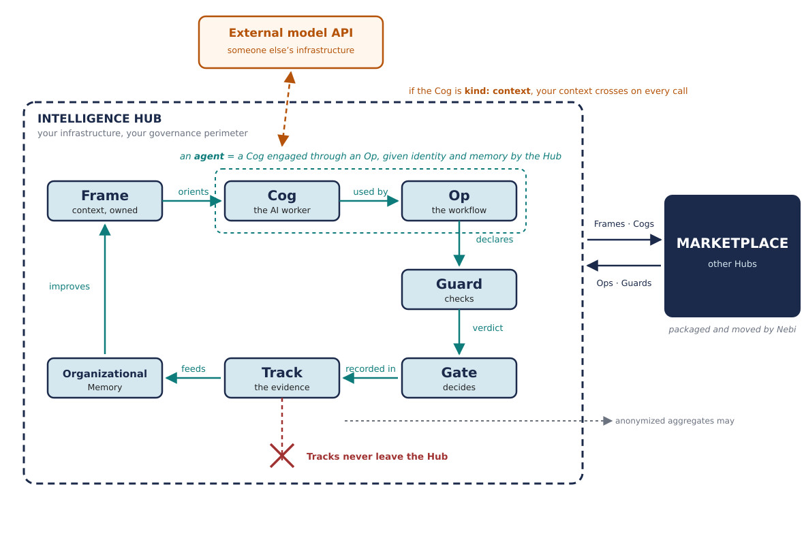

# Paper vs. Implementation — an audit of Whitepaper v9

**Status:** working notes by Pearu Peterson, August 2026. Not part of the whitepaper.
**Do not commit this file to `inthub-whitepaper`.**

## Purpose and method

The whitepaper introduces a vocabulary — fourteen terms in `GLOSSARY.md` — defined in prose
and specified nowhere. Most of the concrete ones already exist as code in the `openteams-ai`
GitHub org. This document puts the two side by side, so that "apply the ideas in practice"
starts from what is actually built rather than from what the paper asserts.

This audit is one of two instruments pointed at the paper, and they check different things:
the audit checks it against the **shipping code**; the companion
[translation](whitepaper-translation.md) checks it against a **theory built from first
principles** (`definitions.md`, `organisational-definitions.md`). Divergences here are
labelled DV1–DV11; D-numbers in this study belong to the theory's entries.

Every criticism below is followed by **options for resolving it**, with who would own the
change and roughly what it costs. Where I have no good suggestion, I say so rather than
invent one. The options are alternatives to choose between, not a plan — several are
mutually exclusive on purpose.

Everything was verified by reading the sources directly (`gh` against the org; anonymous
WebFetch where public), and **re-verified against Revision 9 on 2026-08-07** — every
quotation below was re-checked against `whitepaper.md` and every cited section number
confirmed. Nothing here rests on a search-engine snippet.
What was not checked is listed under
[Outside this audit's coverage](#outside-this-audits-coverage) rather than asserted.

Sources read:

| Source | Version / state |
|---|---|
| `whitepaper.md` + `GLOSSARY.md`, `MESSAGING.md`, `SOURCES.md`, `briefs/executive-brief.md` | Revision 9, August 2026 |
| `openteams-ai/frame-spec` — `spec/frame-spec.md`, `USING-FRAMES.md`, `examples/minimal/frame.md` | Frame Spec **v0.2**, "still an early draft" |
| `openteams-ai/cog-spec` — `README.md`, `SPEC.md` (896 lines), tree | CogSpec **v0.1**, "public discussion draft… not been adopted as the official 0.1 release" |
| `openteams-ai/cog-catalog` — `README.md`, tree | portfolio-planning stage; no published Cogs |
| `openteams-ai/apollo-capabilities` — `README.md`, `spec/SCHEMA.md` | capability schema **0.1.0**, unreleased |
| `openteams-ai/checkmaite`, `modelmaite`, `datamaite` | shipping, public, CDAO JATIC |
| `openteams-ai` repo list (240 repos, name + description) | as of 2026-08-06 |
| **Prior-art survey (§8–10)** | NumPy, SciPy, PyTorch, JAX, XLA, StableHLO, MLIR/LLVM, Arrow, mpmath, conda-forge, `array-api-tests`, `functional_algorithms`, `complex_function_validation`, `praiser` |

Counts and line numbers quoted below were read from sources current in August 2026. Figures
of that kind drift; the orders of magnitude, and the patterns they evidence, do not.

---

## 0. What Revision 9 changed

Re-verified 2026-08-07. Every quotation in this audit survives into v9 and every cited
section number is unchanged, so the findings below stand unless noted.

**What v9 fixed.** Two of this audit's readability complaints are now addressed in the paper
itself. *A Note on Vocabulary* adds a Rosetta table mapping each new term to the industry
word it replaces, with the difference stated in one line — and commits to the rule that a
term unable to state its difference in one line does not deserve to exist. That is the single
best addition in v9. And §4.2, formerly "How Frames, Cogs, and Ops relate to Agents", is
rewritten as "Where Agents Fit": the paper now *defines* an agent — *"a Cog engaged through
an Op, given identity and memory by the Hub"* — rather than avoiding the word, and frames the
whole architecture as employment rather than construction.

**What v9 did not touch.** §2 (Guards, Gates and Tracks unbuilt), DV1, DV2, DV3, DV5, DV6, DV7, DV8
and DV9 are unchanged. The accountability plane still has no repository in the org.

**What v9 sharpened.** DV4 — the Rosetta table now describes a Cog as packaging "permissions",
restating the paper's side of the disagreement with CogSpec a second time rather than
softening it. And a new finding, DV10, follows directly from what v9 chose to define.

**Sources.** v9 adds entries 32 (Cloudflare OS) and 33 (Earendil Works, session portability);
both URLs resolve.

---

*The relations between the concepts, organised around the boundary — because that is where
the sovereignty claim is actually decided. Three crossings, and they are not equivalent:
artifacts move both ways; Tracks never leave, though anonymized aggregates may; and a
`kind: context` Cog sends context out on every single call. The paper's own two figures show
the layer stack and the validation lifecycle, and neither shows any of this.*

---

## 1. Concept-by-concept

| Paper concept | What the paper claims | What exists | Gap |
|---|---|---|---|
| **Frame** | Scoped, inheritable, composable, shareable, discoverable, owned. Carries rules, terminology, goals, style, norms, skills, tool specs, prompts, architecture, business process, **and Output Guards**. | `frame-spec` v0.2: Markdown + YAML frontmatter. Required: `type`, `name`, `description`, `visibility`. Recommended: `version`, `scope`, `maintainer`, `inherits`. Ships `tools/validate_frames.py`, an HTML builder, authoring/reader Skills. | **No Guard field.** No provenance. Inheritance non-transitive. See DV1–DV3. |
| **Cog** | Encapsulates a model, a context incl. Frames, "the skills, tools, and APIs it has access to", and "its governance parameters: what data it may access, what actions it may take, what requires human approval". Three types: model-heavy / context-heavy / combined. | `cog-spec` v0.1: a directory with `COG.md` (fixed entry file) + a manifest it names. `kind: model \| context \| complete` — **matches the paper's three types**. Strict YAML subset for frontmatter. Conformance fixtures + validator rules. | Manifest format deliberately undefined. Permissions explicitly *excluded*. See DV4–DV5. |
| **Op** | Installable, versioned, Frame-oriented, supervised, triggerable, self-contained, composable. Declares a Validation Strategy. | **No Op spec repo.** The shipping catalog (`apollo-capabilities`) calls them **Progs**. The paper's §5.6 YAML manifest sketch is the only concrete Op artifact anywhere. | Whole concept unspecified; name diverged. See DV6. |
| **Guard** | Seven categories. Installable, versioned, shareable. "every Op **should** declare its Guards" (§5.1) — but `GLOSSARY.md` says **must**. | **Nothing.** No repo among 240 searched by name or description. | Total. See §2, DV9. |
| **Gate** | Decision points; Guards check, Gates decide. Maps to EU AI Act Art. 14. | **Nothing.** CogSpec explicitly excludes "machine-enforced permissions and approvals". | Total. |
| **Track** | Durable evidence record; retained, not exchanged. Maps to EU AI Act Arts. 12/19. | **Nothing.** CogSpec explicitly excludes "deployment, execution, or run records". | Total. |
| **Nebi** | Packaging + reproducibility; "defines the common format by which Frames, Cogs, Ops, and Guards can be packaged"; makes the marketplace technically possible. | **Real, and narrower.** `nebari-dev/nebi` — "Server and CLI for managing multi-user Pixi environments"; nebi.nebari.dev: "Environment management for teams". Push/pull workspace specs, version tags, spec diffs, publish to OCI. `nebi-pack` (Keycloak + PostgreSQL), `nb-nebi-kernels`, conda feedstocks. `apollo-capabilities` imports via `nebi import <ref>` then `pixi run launch`, metadata under `[tool.nebi.capability]`. | Paper describes none of the mechanism, and claims an artifact-packaging format that does not exist. See DV8. |
| **Nebari** | Flagship OSS contribution; modular stack, 15+ packs. | Real, external (`nebari.dev`). | — |
| **Intelligence Hub** | Per-customer assembly. | By design not a single artifact. `apollo-capabilities` targets are `local` and `hub`. | — |
| **Organizational Memory** | Persistent context substrate; continuum of implementations. | Not a repo; §3.4 lists ~7 tool families as options. | Concept only, by design. |
| **Desktop/Web App** | The Human Gateway. | `apollo-desktop` ("Cross-platform desktop application for Nexus Hub"), `collab.openteams.app`. | Private; not read. |

---

## 2. The hole in the middle

**Guards, Gates, and Tracks — the entire Accountability Plane, the headline addition of
Revision 8 and still unbuilt at Revision 9 — have no repository, no spec, and no
implementation.** Searching all 240 repos
in the org by name and description returns nothing for `guard`, `validat`, `verif` or
`conform`; the `track` hits are a marketing repo and an internal platform one.

This is simply where the work is. Travis said as much in Slack: *"For any practical
application, these ideas need to be fleshed out and created."* Two facts sharpen it:

1. **The specs that do exist have carefully excluded exactly this.** CogSpec v0.1's "what
   v0.1 does not try to define" list includes, verbatim: *"machine-enforced permissions and
   approvals"* (Gates), *"evaluation formats or evidence requirements"* (Guards),
   *"deployment, execution, or run records"* (Tracks), and *"execution-portability
   claims."* The specs are honest about their boundary. The paper is not: it describes all
   four as though they were settled.

2. **OpenTeams already ships production validation tooling the paper never mentions.**
   `checkmaite` is "an API and a UI application which makes testing and evaluation of
   models and datasets straightforward and reproducible", built on the MAITE protocols for
   CDAO JATIC, with `modelmaite` and `datamaite` alongside. That is Guard-shaped work
   already in production for a defense customer with real accountability requirements.

### Options

**2a — Harvest before specifying.** Inventory the Guards that already exist under other
names — `checkmaite`/MAITE evaluators, `frame-spec/tools/validate_frames.py`, cog-spec's
validator + conformance fixtures, `praiser`'s CI completeness-guard tests — and derive a
common interface from what they share. *Owner:* anyone; the inventory is a document.
*Cost:* days. **Note this is what the org's own rules ask for**: CogSpec says a future
boundary "should normally be supported by multiple real Cogs, a concrete interoperability
or safety need, and implementation experience."

**2b — Interface first, taxonomy later.** Skip the artifact format and define only the
Guard call signature: what a Guard receives and what it returns (see W4 below). The seven
categories then become implementations of one interface, and Gates become pure functions
over verdict records. *Owner:* whoever writes `guard-spec`. *Cost:* a draft plus two or
three real Guards to test it against. *Risk:* specifying ahead of experience, which is the
failure mode 2a is designed to avoid.

**2c — `guard-spec` v0.1 in the house style.** Mirror CogSpec's minimalism: define what a
Guard *is* as an artifact (entry file + named manifest), not what it checks. Consistent
with the two existing specs and cheap to review. *Cost:* low. *Weakness:* an artifact
format without a call signature still doesn't let anyone run a Guard.

**2d — Adopt an existing standard instead of inventing one.** MAITE already defines
protocols for model/dataset test and evaluation, and OpenTeams already implements them.
Ask whether Guards should be a thin profile over MAITE for the ML cases plus something
simpler for deterministic checks, rather than a parallel vocabulary. *Cost:* a comparison
memo. *Upside:* aligns with a defense customer's existing requirements.

**2e — Do nothing yet, deliberately.** Let Guards stay prose until enough Ops exist to
show what they actually need. Record the decision so it is a choice rather than drift.

---

## 3. Verified divergences

Each is checkable against the cited source. These are the feedback-worthy items.

### DV1 — The Frame spec cannot express the Frame capability the paper calls critical

Whitepaper §4.3 gives it a whole heading: *"One of the critical things that Frames can do
is define a Validation or Verification tool (a Guard) that must be called and pass on the
output of the system."* Frame Spec v0.2 has no such field — not required, not recommended,
not mentioned. A Frame today cannot declare a Guard.

The theory makes the stakes exact: D19[frame] defines a frame as a check specification that
is itself model-input text — the declaration is the *entire* mechanical content, since the
prose part cannot bind a model ([translation](whitepaper-translation.md) §2.2–2.3). A Frame
spec without a `guards:` field therefore omits the only part of the paper's Frame that
machinery can see.

**Options.** (i) Add an optional `guards:` list to Frame Spec v0.3 — but this is *blocked
on §2*, since a reference needs something to refer to. (ii) Interim, unblocked: record
intended Guards in the existing `metadata` string map. No runtime meaning, but it captures
authorial intent and generates evidence about whether anyone actually wants the feature.
(iii) Cheapest today: soften §4.3 from a critical present-tense capability to a stated
intention, so paper and spec agree. *Owner:* (i)/(ii) a `frame-spec` PR — the repo is
public; (iii) a paper edit.

### DV2 — Frame inheritance is not reproducible, by the spec's own admission

The paper lists among a Hub's characteristics: *"Stores, versions, and manages the
inheritance graph of organizational Frames"*, and says of inheritance that *"the chain of
authority is auditable."* The spec:
*"Inheritance is not transitive by default… Because transitive resolution is optional, the
same Frame may behave differently across tools."* An auditable chain of authority and a
chain that resolves differently per tool are not the same thing.

**Options.** (i) Make transitive resolution mandatory in v0.3 with a specified total
precedence order, so a given Frame set yields one context everywhere. Costs the spec its
"adopt-now" simplicity. (ii) Keep resolution optional, but require an implementation to
**emit the resolved Frame set it actually used**. Divergence becomes observable instead of
silent — and that emitted record is a Track, so this pays into §2 as well. (iii) Narrow
the paper's claim to what v0.2 supports. (iv) Do both (ii) and (iii): honest now,
deterministic later. *Cost:* (ii) is small and, in my view, the highest value-per-line
change available in the Frame spec today.

### DV3 — The marketplace premise collides with the spec's trust posture

The paper builds Layer 3 on Frames flowing between organizations, to partners, vendors and
customers. The spec: *"implementations and users should only load Frames from trusted
sources and should not treat a Frame's contents as verified"*, with provenance explicitly
deferred. CogSpec says the same of Cogs: *"Implementations and users should treat Cogs as
untrusted instructions unless they trust the source."* The paper cites OWASP's LLM01 prompt injection in §5.8 without
connecting it to its own distribution model.

**Options.** (i) Signing and provenance in the spec — the real fix, deliberately deferred,
and heavy. (ii) Distinguish two distribution modes in the paper: sharing *inside* a trust
boundary (works today) versus installing from an open registry (needs provenance that does
not exist yet). A paragraph, and it removes the contradiction. (iii) Make a prompt-injection
Guard one of the first Guards built — the paper already cites the risk, and it is the kind
of check the ecosystem can share. (iv) Require Frames to declare a `provenance` block
(origin, author, signature-when-available) as recommended-not-required in v0.3, so tooling
can start recording it before verification exists.

### DV4 — The paper's Cog carries permissions; CogSpec's Cog explicitly does not

Paper §4.4: a Cog encapsulates *"the skills, tools, and APIs it has access to"* and *"its
governance parameters: what data it may access, what actions it may take, what requires
human approval."* CogSpec v0.1: *"Installing any Cog makes its supported resources
available; it does not grant tools, credentials, data access, network access, or other
authority."*

Revision 9 restates the paper's side a second time rather than softening it: the Rosetta
table in *A Note on Vocabulary* describes a Cog as *"model, context, tools, and permissions
packaged so they can be installed and audited."* The divergence is now asserted in two
places in the paper and denied in the spec, so it will not resolve itself.

The spec's position is the safer one, and the disagreement looks resolvable rather than
deep. **Options.** (i) Adopt a *declare-versus-grant* split in the paper: a Cog **declares**
the tools and data it expects; the **Hub grants** authority at install or run time. Both
documents then become true, no capability is lost, and it gives the Hub a concrete job in
the security story. One paragraph in §4.4. (ii) Leave the paper and add a footnote that
governance parameters are Hub-side. (iii) Change the spec to match the paper — I would
argue against it: a package that grants its own authority is the supply-chain failure mode.

### DV5 — "Install once, run anywhere" is not what the Cog spec provides

Paper §4.5: an Op *"can be authored once and deployed into any Intelligence Hub that
implements the standards needed"*, likened to NPM and pip. The qualifier is there, and it is
the right one — but it currently names an empty set. CogSpec does not define the manifest
format, therefore *"Cogs using different manifest schemas are not necessarily
interoperable"*, and *"execution-portability claims"* are explicitly out of scope. There is
no standard a Hub could implement in order to earn the guarantee. pip works because the
wheel format is specified; that is what turns the same qualifier from a hedge into a
contract.

**Options.** (i) State the qualifier: portability holds *within* a manifest profile, and
name the profile OpenTeams uses — the separate `cogspec` repo appears to be exactly that.
Cheap and honest. (ii) Do for Cogs what PEP 427 did for Python: promote
one manifest into the core once enough real Cogs exist to show what it must carry. The
harvest rule from 2a applies. (iii) Keep the npm/pip line but label it a goal rather than a
description. (iv) Add a conformance suite that *tests* portability — cog-spec already ships
validator fixtures, so the pattern exists; extend it from "is well-formed" to "produces
equivalent behaviour across two implementations." Relevant experience: `numpy.distutils` is
a long-running demonstration of what happens when the build/packaging contract is never
specified, and the wheel is the counterexample.

### DV6 — Ops ship as Progs

`apollo-capabilities`: *"**Progs** (Programs) are apps, workflows, services, notebooks, and
other runnable tools."* `MESSAGING.md` instructs the opposite: *"do not improvise new
phrasings of the core concepts — extend this file instead."*

Before renaming anything, note they may not be the same concept. The catalog says *"A Prog
may use one or more Cogs, but it does not have to"* — but the paper's Op is *defined* as
composing Cogs under supervision with a Validation Strategy. A JupyterLab launcher is a
Prog and is clearly not an Op.

**Options.** (i) Treat them as two concepts and define the relationship in `GLOSSARY.md`:
Prog = runnable capability, Op = supervised AI workflow that composes Cogs and declares
Guards; every Op is a Prog, not every Prog is an Op. This looks like the truthful
description of what is already shipping. (ii) Rename Progs to Ops in the catalog, if they
really are meant to be one thing. (iii) Rename Ops to Progs in the paper — costly, since
"Op" carries the whole §4.5/§5.6 contract. Related smaller drift, cheap to fix either way:
`MESSAGING.md` says to reuse the Vendor Fraud Review example everywhere, while cog-spec's
worked examples are a dependency-risk analyst and a repository-risk analyst.

### DV7 — Four marketplace classes; two of them are empty

Frames (v0.2 draft), Cogs (v0.1 discussion draft), Ops (nothing), Guards (nothing). And
`cog-catalog` is explicit that it holds *"decision inputs, not published Cogs"* — 26/24/25
scored candidates across four portfolio analyses, zero published.

**Options.** (i) Add a maturity column to the paper's artifact table (§6.1): spec status
and first-artifact status per class. It costs one column, it is honest with the investor and
AI-builder audiences the paper names, and it converts a weakness into a roadmap. (ii) Say
it in §10 instead, sequencing the four classes explicitly. (iii) Publish one real artifact
per class, however small, so the table is true as written — the strongest answer, and the
most work.

### DV8 — The paper's Nebi is much larger than the shipping Nebi

Paper §3.2 makes Nebi load-bearing for the whole marketplace: it "defines the common format
by which Frames, Cogs, Ops, and Guards can be packaged for distribution", and with it
"reproducibility is guaranteed by construction."

What actually ships: `nebari-dev/nebi` is a **"Server and CLI for
managing multi-user Pixi environments"**, and nebi.nebari.dev calls it *"Environment
management for teams"* — track Pixi workspaces locally, push specs to a Nebi server, pull
them on another machine, tag versions, diff specs across versions or directories, publish to
OCI registries. `nebi-pack` adds Keycloak SSO and PostgreSQL; there are conda feedstocks for
`nebi` and `nebi-desktop`, and `nb-nebi-kernels` exposes nebi workspaces as Jupyter kernels.

An environment manager is not an artifact packaging format. `apollo-capabilities` shows what
exists today: a capability is a `pixi.toml` carrying a `[tool.nebi.capability]` metadata
block — a convention layered on Pixi, not a Frame/Cog/Op/Guard format. And cog-spec
deliberately leaves the Cog manifest undefined (DV5), so there is currently no artifact
format for Nebi to package *to*.

**Options.** (i) Narrow the claim to what Nebi does — environment reproducibility, which is
real, shipping and valuable. (ii) State the layering explicitly: Pixi resolves, Nebi
versions and distributes, and an artifact format still has to be defined on top; the paper
currently reads as though the third layer exists. (iii) If the four artifact classes really
are to be Nebi-distributed, say which manifest they use — blocked on DV5. (iv) Map Nebi onto
W3's tiers, which is the most precise available statement: Nebi can deliver **tier one**
(environment) by construction, contributes to **tier two** (artifact) through OCI digests
and version tags, and cannot address **tier three** (output) at all. That last is what
Guards are for.

### DV9 — The paper and its own glossary disagree on whether Guards are mandatory

`GLOSSARY.md` declares itself *"the authoritative definition set… Decks, briefs, web copy,
and future revisions should cite or copy these definitions rather than re-paraphrase them."*
On Guards it states: *"Frames can declare associated Guards; every Op **must** declare its
Guards."* The paper's §5.1 states the same principle as: *"Frames can declare associated
Guards, but **every Op should declare its Guards**."*

Must and should are not the same instruction, and this is the one place it matters most —
whether declaring validation is a requirement of the Op contract or a recommendation. §5.6
leans toward *must* (*"An Op is not complete unless it declares how its work will be
verified"*), which leaves the paper internally split as well.

**Options.** (i) Settle on **must** and align §5.1 to the glossary and §5.6 — consistent
with the Validation Strategy being part of every Op's contract, and with the regulatory
framing the paper invokes. (ii) Settle on **should**, and remove the "not complete unless"
sentence from §5.6, accepting that Guards are recommended practice. (iii) Distinguish the
two deliberately: *must declare*, even if the declaration is "no Guards required for this
risk class" — which keeps the contract intact while allowing low-risk Ops to be cheap. That
third option is how required-but-empty declarations usually work in practice.

### DV10 — The paper defines the composite but not the primitive

v9 defines an **agent** precisely, in both the glossary and §4.2. It does not define a
**worker** — yet that is the word the definition of a Cog rests on. §4.4 and `GLOSSARY.md`
both open with *"A discrete, AI-powered worker"*, and "worker" appears seven times in the
paper without ever being said.

This is not pedantry; it has a measured cost. Readers supply their own intuition for
"worker", and because most people's intuition is something *active*, a Cog — which is handled
like a package, cloned and versioned — gets demoted in the reader's mind to a *description*
of a worker. The paper's author reports exactly this pattern, including one reader who
concluded the Cog was the harness. Both are the same error in mirror image: taking the part
for the whole, or the packaging for the thing.

The material to fix it already exists in CogSpec, which does define it without circularity:
*"a portable, installable AI worker: a durable role and work contract, the context that
grounds it, and — where the Cog carries one — the model that performs the work"*, plus
*"A Cog is not, merely by being loaded or installed, a running process, account, deployment,
or grant of authority."*

**Options.** (i) Lift CogSpec's formulation into §4.4 and the glossary, so the paper defines
its own primitive. (ii) Add one analogy — a **container image** or a firmware image: a thing
that contains the engine, not a manifest describing one, and `docker run` does not create a
different entity. (iii) Publish one worked `kind: complete` Cog. Both of CogSpec's current
examples are `kind: context` — context pointing at a remote model — so the case that proves
"model plus harness" is never actually shown. (iv) All three; they are cheap and they
reinforce each other.

### DV11 — The boundary crossing that matters most is the one nobody draws

The architecture's central promise is that context stops leaking. §6.1 governs the artifact
crossings — Frames, Cogs, Ops and Guards exchanged; Tracks retained, with *"anonymized or
aggregated Track data"* permitted out for trust signals. §4.2 handles identity, with
*"credentials brokered and scoped rather than copied."* All of that is careful.

None of it is the high-volume crossing. §4.4 defines the second Cog type as one that
*"focuses on the data and context to be sent to the model which is pointed to (either via
dependency or an API end-point)."* If that endpoint sits outside the perimeter, then on
**every invocation** the assembled working context — Frames included — leaves the Hub, and a
completion returns. Continuously, at a volume that dwarfs occasional artifact exchange.

D11[assembly] adds that the crossing is not inspectable after the fact: boundaries between
the assembled texts do not survive assembly, so what leaves the perimeter is one
undifferentiated text — the receiving endpoint cannot honour distinctions the assembly
already erased ([translation](whitepaper-translation.md) §2.4).

So sovereignty is not a property of the Hub. It is a property of a single field on each Cog:

| `kind` | At inference time |
|---|---|
| `complete` | weights inside the perimeter; nothing crosses |
| `model` | weights inside the perimeter; nothing crosses |
| `context` | points elsewhere; **the context crosses on every call** |

A Hub populated entirely with `kind: context` Cogs aimed at vendor APIs reproduces exactly
the failure mode §1 opens with. The architecture does not prevent this — it supplies the
vocabulary to notice it and the field to set.

Two signs this is the default rather than the edge case. Both of CogSpec's worked examples
are `kind: context`. And the one written-up existence proof of the execution layer — a
colleague's account of running his workday this way — states plainly that his context lives
in vendor accounts.

**Options.** (i) Say it in §4.4: the three Cog kinds are not merely a packaging convenience,
they are the sovereignty decision, and `kind: context` against an external endpoint means the
context leaves. One paragraph, and it makes the paper's own argument sharper. (ii) Have Ops
declare their inference boundary the way they declare Guards, so a Validation Strategy can
require that a high-risk Op runs only on in-perimeter models. (iii) Make it a Guard category —
a pre-flight check that refuses to run an Op whose Cogs point outside, for data classes that
may not leave. (iv) Draw it. Figure 1 shows three layers and a plane; no figure shows the
perimeter or what crosses it, which is the thing a customer actually asks about.

---

## 4. Where the paper is strong, for a practitioner

- **§5.5, the seven Guard categories** (Algorithmic, Source-Grounding, Consensus, Expert,
  Policy & Safety, Regression & Drift, Outcome) is the most immediately usable taxonomy in
  the document, and it maps onto tools that already exist.
- **§5.6's Op manifest sketch** is the only place the paper commits to a concrete artifact.
  It is small enough to criticize precisely — the best entry point for feedback.
- **The Guards/Gates split is a genuinely good distinction.** "Guards check, Gates decide"
  separates a predicate from a policy. Most test frameworks conflate the two, and the
  separation is what lets one check drive different consequences in different risk contexts.
- **v9's Rosetta table** (*A Note on Vocabulary*) is the most practitioner-useful page in
  the paper. Stating each term's delta from the industry word in one line, and committing to
  drop any term that cannot, is a discipline most vocabulary-introducing documents skip.
- **§5.4's four lifecycle stages** (pre-flight / in-flight / post-run / continuous) is a
  useful axis that ordinary test tooling does not name.

## 5. Where it is weak, for a practitioner

### W1 — No tolerance model anywhere

Guards return pass/fail; Gates branch on `confidence < 0.80`. But every hard validation
problem lives in what counts as agreement. The Consensus Guard is stated only for the
discrete case ("three Cogs classify a document and two must agree"). For numerical output,
"equal" is a choice of tolerance, not a fact.

The theory places a floor under the problem: tolerance ends where sampling begins —
D12[sampler]'s Notes record that two symbols are the same or they are not, with no notion of
*nearly*, so variation negligible in a scoring is not negligible in an output. A tolerance
model must therefore live at the scoring or verdict level — Guards comparing scores or
extracted numbers — never at the token level.

**Options.** (i) Require a Guard to declare its comparison semantics as a first-class
field: `exact`, `tolerance(rtol, atol)`, `ulp(n)`, `statistical(test, alpha)`, or `rubric`.
One field, and Consensus Guards become implementable for continuous outputs. (ii) Adopt
existing vocabulary rather than inventing: `numpy.testing.assert_allclose`'s `rtol`/`atol`
is the industry default and is already understood by everyone the paper wants as Guard
publishers. (iii) Keep pass/fail in the core and push tolerance into each Guard's private
config — simplest, but then two Guards claiming the same check are not comparable, which
undermines the marketplace. (iv) Harvest first: `complex_function_validation` already does
exactly this comparison across NumPy, PyTorch, JAX, TensorFlow and MPMath; derive the field
set from what it needed in practice.

### W2 — No measurement story

Nothing in the paper says how you would know a Frame is working, or that adding one
improved anything.

**Options.** (i) Define the metrics as derived from Tracks, so they come free once Tracks
exist: Guard pass rate, Gate escalation rate, human-override rate, cost per Gate. (ii) Make
Frames falsifiable with an A/B: run the same Op with and without a Frame and compare Guard
pass rates. That is a real test of whether a Frame earns its tokens, and the paper currently
asserts the benefit without one. (iii) Add an Outcome Guard example that measures a *Frame*
rather than an Op — the seven categories currently only measure work, not context. (iv) If
none of this is wanted in the paper, say plainly that measurement is deferred, so it reads
as a choice.

### W3 — Reproducibility is asserted, then hedged in a parenthesis

§3.2: an Op installed in one Hub *"behaves identically (within generative AI limits)"*
elsewhere. That parenthesis carries the entire difficulty of the claim.

The theory derives its exact content: a run is fixed by components, starting text, and
draws (D14[model run]); a shipped artifact pins the texts and draws exactly, and the model
only as a specification — a *set* of models, never one (D10[model specification],
[translation](whitepaper-translation.md) §2.1). "Identical (within generative AI limits)"
means: identical starting text and draws, some member of the same set.

**Options.** (i) Split the claim into three tiers and claim each honestly: **environment**
reproducibility (Nebi can genuinely guarantee this — pinned deps, OCI digests);
**artifact** reproducibility (hashes, versions, resolved Frame sets — achievable today);
**output** reproducibility (not achievable for sampled generation; only boundable). (ii)
Having split it, say that tier three is precisely what Guards are for — the hedge becomes
the argument for the Accountability Plane instead of a weakness in it. (iii) Add a
reproducibility statement to the Op contract alongside the Validation Strategy: which tier
this Op claims. *Note:* tier one is Nebi's existing job; tiers two and three are unowned.

### W4 — Guards are described as artifacts, never as code

Seven categories, no interface: no statement of what a Guard receives or returns. It is the
one place the paper points at code and then doesn't write any.

**Options.** (i) Write the signature — the single change that unblocks everything else in
§2. A minimal proposal: a Guard receives the artifact under test plus execution context
(Frames applied, sources consulted, model and config), and returns a verdict record —
`status`, `score`, the threshold or tolerance actually used, evidence links, and cost.
Gates then become pure functions over verdict records, which makes them testable in
isolation. (ii) Derive it from `checkmaite`/MAITE rather than proposing fresh. (iii) Leave
Guards as prose in the paper and put the interface in `guard-spec`, keeping the paper
conceptual — defensible, provided the spec actually gets written.

The verdict record above is also what a Track is made of, which suggests Guards and Tracks
should be specified together rather than as separate efforts.

---

## 6. Outside this audit's coverage

Stated so the reach of everything above is unambiguous.

- The private repos `apollo-desktop`, `cogcloud-*`, and `nebari-frames`, and `cogspec` — the
  OpenTeams manifest profile, distinct from `cog-spec`. `cogspec` matters most: it may
  already answer DV5, in which case DV5 reduces to a documentation gap.
- Nebari's "more than fifteen software packs" (§3.1). Worth counting before the next
  revision, since the number appears in the paper.
- The `SOURCES.md` statistics. The register already flags its weaker entries and instructs
  re-verification before each release; that instruction is sound and should simply be
  followed.
- **Formal verification as a Guard.** The POSTLean work — applying Lean to generative
  output — is the most rigorous member of the paper's Algorithmic Guard category, and
  nothing in §5.5 acknowledges that a Guard can be a proof rather than a test. It bears
  directly on W1 and W4 and deserves a place in the paper.

---

## 7. Resonance — where this meets 25 years of prior work

Not a ranking. Evidence for one.

**The accountability plane already runs in `praiser`, under other names.** From its
`AGENTS.md`: a *"completeness guard test… fails CI if a `register()`-ing module is missing
from that list"*; *"Evidence always has a clickable `url`… No claim without a link a human
can verify"*; and a calibrated confidence scale (handle/email ≈ 0.85–0.9, name-only ≈
0.4–0.55, corroboration bumps it). That is a Guard, a Track, and the Consensus/Confidence
machinery the paper's Gates branch on — shipped, with the thresholds justified.

**`praiser/AGENTS.md` is a Frame that argues against Frames.** Its central convention:
*"Extension points must be auto-discovered or guarded, never a prose-synced list… A
manually maintained list whose only safeguard is documentation is a latent bug: the
'register `wikipedia`/`releases`' step was documented in three places and still silently
skipped (extractors never ran in production; #124). Make the wrong thing impossible or loud
— don't rely on the extender reading the docs."*

A Frame is prose that a Cog is supposed to read and honor. This is the strongest available
argument that prose alone fails silently, and it comes with an issue number. The paper's
only answer is DV1 — the one sentence about Frames declaring Guards, which the spec does not
implement. `frame-spec`'s own `USING-FRAMES.md` already half-concedes the point: a Frame is
*"not a substitute for deterministic computation."*

**`complex_function_validation` is a reference-oracle Guard with a graded verdict
vocabulary.** MPMath at higher precision is the **oracle**, not a peer voter:
a `complex64` grid is promoted to `complex128`, evaluated by the reference, and demoted for
comparison. The result is not pass/fail but **nine verdict classes** — `=` exact, `c` close
(`diff < eps*norm`), `1`–`F` a fifteen-level graded band (`diff < eps*norm*10**n`,
`n < resolution`), `x` magnitudes close, `X` different, `~` both non-finite and same kind,
`I` one finite one infinite, `N` one non-nan other nan, `M` the reverse — rendered as a map
of the complex plane so failure *regions* are visible.

Note what the last four symbols do: they distinguish *kinds* of disagreement that a scalar
confidence score destroys. `I`, `N` and `M` are not degrees of wrongness, they are different
failure modes, and `N` versus `M` even records the direction. This is the most developed
answer to W1 and W4 in any code I read, including the large frameworks.

**`functional_algorithms` states an explicit accuracy contract and demonstrates why W3
needs three tiers.** Its algorithms are "designed to be accurate upto maximal 3 ULP
difference between computed and reference values" — a declared, checkable numerical
contract of exactly the kind the paper's Guards lack. It generates one definition to
Python, NumPy, C++, XLA/Client and StableHLO, and the cost is measured rather than assumed:
`asin` is ~45 LOC for the Python/NumPy target and 186 LOC for StableHLO. Most telling for
the paper, the README records that some algorithms are sensitive to **FPU denormal register
state** — identical source, identical target, different environment, different numerical
result. That is tier-one reproducibility failing without any AI involved, and it is the
concrete experience behind W3's split.

**conda-forge is Nebi's problem domain.** Nebi is a server and CLI for
versioned, shareable **Pixi** workspaces published to OCI registries; Pixi resolves conda
packages, overwhelmingly from conda-forge. Multi-platform binary distribution, dependency
pinning and environment reproducibility are one problem, and a feedstock maintainer has
been inside it for years.

**`numpy.distutils` is a different lesson.** It is a build system, not an environment
manager. Its relevance is as DV5's cautionary tale: a build-and-packaging contract that was
never specified, accreted for two decades, and eventually had to be removed in favour of a
specified one.

**F2PY is a third thing again.** It reads a declared Fortran interface and generates the
binding. That is the *declare the interface, generate the glue* pattern, which bears on Cog
manifests and on DD4's declarative verification — not on environment reproducibility.

**Adjacency, noted once:** the org is rebuilding SciPy in POST Python (`ppspecial`,
`ppstats`, `ppspatial`, `ppconstants`). The SciPy co-founder has no commits there.

---

## 8. Prior art — the matrix

The audit above compares the paper to OpenTeams code. This section compares it to mature
open-source practice, on the hypothesis that the Accountability Plane may already exist
under other names. Read from the freshest available checkout of each project;
`array-api-tests` via GitHub.

Empty cells are findings, not omissions.

::: matrix

| Project | Frame | Guard | Gate | Track | Cog / Op |
|---|---|---|---|---|---|
| **NumPy** | **61 NEPs** in `doc/neps/`; dev guide | `assert_allclose(rtol=1e-7, atol=0)`; test suite | 8-state NEP lifecycle, in live use | git history; NEP records | — |
| **SciPy** | `doc/source/dev/governance.rst`, `toolchain.rst`, `roadmap.rst`, `api-dev/` | `xp_assert_{equal,close,close_nulp,less,less_equal}` with `check_namespace`/`check_dtype`; **one suite × 6 backends** via `SCIPY_ARRAY_API` | core-dev review; triage policy | — | — |
| **PyTorch** | `CONTRIBUTING`; RFC process | **`OpInfo`: 405 entries, 199 `toleranceOverride`**; `_DTYPE_PRECISIONS` in `torch/testing/_comparison.py`; `gradcheck` | required CI checks | `test-infra`; CI logs | — |
| **JAX** | — | `_default_tolerance` **and** `default_gradient_tolerance`; `check_close` / `check_jvp` / `check_vjp` / `check_grads` | — | — | — |
| **StableHLO** | `docs/spec.md`, **8,000 lines**, **108 ops** with Semantics + Constraints; `governance.md`; `compatibility.md` | `stablehlo/reference/` interpreter; `spec_checklist.md`, `reference_checklist.md`, `vhlo_checklist.md`, `interpreter_status.md` | compatibility policy | — | — |
| **XLA** | — | `xla/service/hlo_verifier.cc`, **4,525 lines**; `hlo_domain_verifier`, `cpu_gpu_shape_verifier`, **`triton_fusion_numerics_verifier`** | — | — | — |
| **MLIR / LLVM** | — | `mlir/lib/IR/Verifier.cpp` (569 lines) + **59 ODS `hasVerifier` declarations**; verification as declarative traits/interfaces | — | — | — |
| **Arrow** | `docs/source/format/` — Columnar, C Data Interface, Flight, canonical extensions | **archery integration: 9 independent language testers** (cpp, java, go, rust, js, csharp, ruby, nanoarrow, …) | `format/Changing.rst` — format change policy | — | — |
| **array API** | the standard itself | `array-api-tests`, `ARRAY_API_TESTS_MODULE`; spec pinned as a submodule | — | — | — |
| **mpmath** | — | arbitrary-precision reference oracle | — | — | — |
| **conda-forge** | feedstock conventions | — | feedstock review | pinned build records | — |
| **`functional_algorithms`** | algorithm definitions as single source | `test_accuracy.py`; **3 ULP contract** | — | — | codegen to 5 targets |
| **`complex_function_validation`** | — | **9-class graded verdict vocabulary** vs MPMath oracle | — | comparison maps | — |
| **`praiser`** | `AGENTS.md` | completeness guard test | confidence thresholds | evidence records with URLs | — |

:::

**The Cog / Op column is empty everywhere.** That is the survey's single most important
result and I return to it in §10.

## 9. Deep dives

### DD1 — The tolerance model already exists, at scale (answers W1)

The paper's Gates branch on a single scalar (`confidence < 0.80`). Mature numerical
software abandoned that shape long ago.

- **PyTorch keys tolerance by dtype, then overrides per operator.** `_DTYPE_PRECISIONS` in
  `torch/testing/_comparison.py` maps each dtype to an `(rtol, atol)` pair; when comparing
  mixed dtypes it takes `max(rtols), max(atols)`. On top of that, the operator database
  carries **199 `toleranceOverride` declarations across 405 `OpInfo` entries** — roughly one
  operator in two needs its own tolerance, sometimes per-dtype
  (`toleranceOverride({torch.chalf: tol(4e-2, 4e-2)})`). The lesson for a Guard registry:
  a global threshold is not merely imprecise, it is *unmaintainable*; tolerance is a
  property of the operation, not of the system.
- **JAX splits tolerance by what is being checked, not just by dtype** — `_default_tolerance`
  and a separate, looser `default_gradient_tolerance`, because a numerically-differentiated
  gradient cannot be held to the same standard as a forward value.
- **SciPy grades the comparison itself.** Not one assertion but a family —
  `xp_assert_equal`, `xp_assert_close`, `xp_assert_close_nulp` (units in the last place),
  `xp_assert_less`, `xp_assert_less_equal` — each also checking `check_namespace` and
  `check_dtype`, so conformance covers *type and namespace*, not only value. And the whole
  suite runs against six array backends (NumPy, `array_api_strict`, PyTorch, CuPy, JAX,
  Dask) selected by `SCIPY_ARRAY_API`: one specification, many implementations, continuously
  cross-checked.
- **XLA ships a Consensus Guard in production.** `triton_fusion_numerics_verifier` compiles
  the same computation down two independent paths — the Triton emitter and the default
  emitters — runs both, and compares the buffers under a *configurable* relative tolerance
  (`xla_gpu_autotune_gemm_rtol`). This is exactly the paper's Consensus Guard category, in a
  shipping compiler, and note what makes it work: the tolerance is a tunable flag, not a
  constant baked into the check.
- **`complex_function_validation` goes furthest** with nine verdict classes that separate
  degrees of disagreement from kinds of disagreement (§7).

Composite proposal for a Guard verdict, grounded in all five: `status` drawn from a small
closed vocabulary that includes failure *kinds*, not just pass/fail; the comparison
semantics actually used (`exact` / `rtol,atol` / `ulp(n)` / `statistical(test, alpha)` /
`rubric`); the threshold in force; and a locator for *where* it failed, since a map beat a
number in practice.

### DD2 — Spec plus reference implementation plus conformance suite (answers DV5)

DV5 says Cogs cannot be portable because the manifest is undefined. Three projects here have
solved precisely that problem, and all three used the same three-part pattern.

- **StableHLO** — an **8,000-line** normative `spec.md` giving each of **108 operations**
  explicit Semantics and Constraints, a **reference interpreter** in `stablehlo/reference/`,
  and four checklists (`spec_checklist.md`, `reference_checklist.md`, `vhlo_checklist.md`,
  `interpreter_status.md`) that track how far implementation has caught up with
  specification. Plus `compatibility.md` and `governance.md`. This is the closest existing
  analogue to what a Cog or Op spec would need — and the checklists are the part most worth
  copying, because they make the spec/implementation gap a tracked number rather than an
  embarrassment.
- **Apache Arrow** — a format spec plus `dev/archery/archery/integration/` with **nine
  independent language testers**, each a separate implementation, cross-tested pairwise
  against generated data. Interoperability is not asserted; it is executed in CI. This is
  the direct answer to "an Op installed in one Hub behaves identically to the same Op
  installed in another."
- **array API** — a standard, and `array-api-tests`, parameterized by
  `ARRAY_API_TESTS_MODULE` so any library can be run against it, with the spec pinned as a
  git submodule so the tests and the document cannot drift.

The pattern to steal: **the conformance suite is a separate artifact from both the spec and
the implementations, and it is parameterized over implementations.** Neither `frame-spec`
nor `cog-spec` has this yet, though cog-spec's validator fixtures are the beginning of one.

### DD3 — Governance documents are Frames, and they have Gates (Frame, Gate)

NumPy's **61 NEPs** are the closest thing in the survey to what the paper means by a Frame —
scoped, owned, versioned, inherited by convention, carrying terminology and rules. What the
paper's Frame lacks, and NEPs have, is a **status lifecycle that is itself the Gate**. The
canonical vocabulary is eight states — `Draft | Active | Accepted | Deferred | Rejected |
Withdrawn | Final | Superseded` — with "Provisional" available in prose as a qualifier on
`Accepted` for proposals that reserve the right to change. Acceptance requires a reference
implementation to be merged before `Final`.

Crucially, the states are **live rather than decorative**. Across the current NEPs:
`Final` 24, `Deferred` 12, `Active` 6, `Accepted` 5, `Superseded` 4, `Draft` 3, `Withdrawn`
1, `Rejected` 1. Twelve deferred and four superseded proposals are the evidence that the
Gate actually decides things — a governance vocabulary where nothing is ever rejected or
retired is not a Gate, it is a filing system.

Frame Spec v0.2 has `version` and `visibility` but no status field and no acceptance
process. Adding a lifecycle would cost one recommended field and would give DV2's "chain of
authority" something to actually record.

### DD4 — Verifiers are Guards, and MLIR makes them declarative (Guard)

XLA's `hlo_verifier.cc` is 4,525 lines of structural checking that runs between compiler
passes — a pre-flight and in-flight Guard in the paper's own vocabulary, at production
scale, and it is one of four (`hlo_domain_verifier`, `cpu_gpu_shape_verifier`,
`triton_fusion_numerics_verifier`). MLIR goes one step further: `mlir/lib/IR/Verifier.cpp` is only 569 lines, because
the driver is generic and the checks live with the operations. **59 files under
`mlir/include` declare `let hasVerifier = 1`**, attaching verification to the operation
definition in ODS rather than writing it as procedural code, on top of the checks that come
free from traits and interfaces.

That is the strongest available argument for the paper's DV1 instinct — that an artifact
should *declare* the checks that apply to it. MLIR shows the shape a Frame or Cog
declaring its Guards could take, and shows it scales.

### DD5 — Reproducibility has tiers, and tier one already fails (answers W3)

`functional_algorithms` records that some algorithms are sensitive to FPU denormal register
state: identical source, identical target, identical inputs, different results depending on
process state. No AI involved. Meanwhile conda-forge's whole apparatus — pinned builds,
feedstocks, migration policy — exists because *environment* reproducibility is hard enough
to need an industry.

This supports splitting the §3.2 claim into environment / artifact / output tiers, and it
sharpens the split: even tier one is a discipline, not a guarantee, and the paper currently
promises tier three.

The tier boundary is derived rather than observed: no text can pin which member of a
specification's set a machine computes (D10[model specification]), so tier three is
unreachable by packaging in principle — the FPU-denormal case is an instance of the theorem.

## 10. What the prior art implies

The matrix supports a nuanced version of the thesis, not the strong one.

**Frame, Guard, Gate and Track are largely renamings.** Every one of them is populated in
the matrix, often by artifacts far more developed than anything the paper describes — NEP
lifecycles, 199 per-operator tolerance overrides, nine-testers-one-format, 8,000 lines of
normative spec with a reference interpreter. The paper is not inventing these; it is naming
a practice that scientific open source has spent thirty years hardening, and it is naming it
less precisely than the practice already does.

**Cog and Op are genuinely new, and the column is empty for a reason.** No project in the
survey packages an AI worker with its context and governance, because none of them needed
to. This is where the paper is actually contributing, and — awkwardly — it is also where
OpenTeams' own specs are thinnest and where `cog-catalog` has zero published artifacts.

**Three consequences follow.** First, the Accountability Plane should be presented as
*adopting proven practice for a new class of artifact*, not as a novel invention; that is a
stronger claim, not a weaker one, because it comes with thirty years of evidence. Second,
the cheapest path to credible Guards is to copy shapes that already work — a conformance
suite parameterized over implementations, a per-operation tolerance registry, declarative
verification attached to artifact definitions — rather than to design from the seven
categories. Third, the parts that genuinely have no prior art are precisely the parts where
non-determinism enters, and that is where original work is actually required.

### The test that has not been run

The strongest objection to this whole vocabulary is that it renames things that already have
names. §8 shows the objection has force: Frame, Guard, Gate and Track are populated across
the matrix by prior art that is older and more developed than anything the paper describes.

But renaming is not by itself disqualifying, and it is worth being precise about why. The
*wheel* renamed "a built distribution of a Python package". A *container image* renamed "a
filesystem plus an entrypoint". A *PEP* renamed "a design proposal". Each mattered — not
because the idea was new, but because once the name was fixed, **independent parties could
build things that composed without negotiating with each other first**. That, and not
novelty, is what a standard vocabulary is for.

Which makes the paper's central claim falsifiable, and the experiment cheap:

> Two people who have never spoken each write a Guard. A third person, who knows neither,
> installs both into an Op and they compose — the verdicts are comparable, the Gate can
> branch on them, and nobody has to renegotiate what "pass" means.

- **If that works**, the vocabulary is doing real work and the renaming objection is
  answered on the only ground that matters.
- **If it cannot be made to work** — because a verdict has no agreed shape, because
  tolerance is private to each Guard, because there is no manifest to install against — then
  the terms are labels for practices people already had, and the honest move is to say so and
  keep the practices.

The [translation](whitepaper-translation.md) reaches the same ground from the theory side:
its §5 lists eight claims testable against any real Hub — where the assembly does or does not
distinguish installed from typed context, whether draws are recorded, which artifact classes
must have owners. This experiment and that list are one programme; whoever runs either should
run both.

**Nobody has run it.** There is no Guard to write one against (§2), no verdict record
defined (W4), no comparison semantics (W1) and no manifest to install into (DV5). Until it is
run, the skeptical reading is the better-supported one, and the paper is best described as a
proposal awaiting its experiment rather than a description of how things work.

The experiment is also far cheaper than the marketplace it would justify: three Guards, one
Op, and two people who agree not to talk to each other. It could be done in a week, and it
would settle more than another revision of the prose can.

## 11. The options, by cost and owner

Nothing here is a recommendation; it is the same options sorted so the cheap ones are
visible. "Paper edit" means a change Travis would make; "spec PR" means `frame-spec` or
`cog-spec`, both of which take outside contributions.

| Cost | Change | Owner | From |
|---|---|---|---|
| One paragraph | Declare-vs-grant split for Cog permissions | paper edit | DV4 |
| One paragraph | Separate in-trust-boundary sharing from open-registry install | paper edit | DV3 |
| One column | Maturity column on the artifact table | paper edit | DV7 |
| One qualifier | Portability holds within a manifest profile | paper edit | DV5 |
| One paragraph | Narrow Nebi's description to environment management; state the Pixi → Nebi → artifact-format layering | paper edit | DV8 |
| One sentence | Map Nebi onto the reproducibility tiers: delivers tier one, contributes to tier two, cannot address tier three | paper edit | DV8, W3 |
| Short section | Split reproducibility into environment / artifact / output tiers | paper edit | W3 |
| Glossary entry | Define Prog and Op as distinct, related concepts | glossary edit | DV6 |
| One word | Settle *must* vs *should* for declaring Guards, across §5.1, §5.6 and the glossary | paper + glossary edit | DV9 |
| One sentence | Define "worker" in §4.4 and the glossary — CogSpec's wording already works | paper + glossary edit | DV10 |
| One analogy | Container image, not manifest: the Cog contains the engine | paper edit | DV10 |
| One example | A worked `kind: complete` Cog, so "model plus harness" is visible once | spec PR | DV10 |
| Small PR | Require implementations to emit the resolved Frame set | spec PR | DV2 |
| Small PR | `provenance` block, recommended-not-required | spec PR | DV3 |
| Small PR | Comparison-semantics field on Guards | spec PR, blocked on §2 | W1 |
| Document | Inventory the Guards that already exist under other names | anyone | 2a |
| Document | Compare MAITE against a fresh Guard vocabulary | anyone | 2d |
| Draft + trials | Guard call signature and verdict record | new work | W4, 2b |
| Ongoing | Metrics derived from Tracks; A/B a Frame | new work | W2 |
| Large | Signing and provenance; manifest in the core; conformance suite | new work | DV3, DV5 |
| *— from the prior-art survey —* | | | |
| One field | Status lifecycle on Frames, modelled on the NEP states | spec PR | DD3 |
| Reframing | Present the Accountability Plane as adopting proven practice, not inventing it | paper edit | §10 |
| Design copy | Verdict record with failure *kinds*, not just pass/fail | new work | DD1 |
| Design copy | Conformance suite as a separate artifact, parameterized over implementations | new work | DD2 |
| Design copy | Declarative verification attached to artifact definitions, MLIR-style | new work | DD4 |
| Focus | Spend original design effort only where non-determinism enters | strategy | §10 |
| One week | Run the interoperability test: two strangers write Guards, a third composes them | new work | §10 |
| One paragraph | State in §4.4 that Cog `kind` *is* the sovereignty decision | paper edit | DV11 |
| Design | Let an Op declare its inference boundary, so a Validation Strategy can require in-perimeter models | new work | DV11 |
| One figure | Draw the perimeter and what crosses it | paper edit | DV11 |
