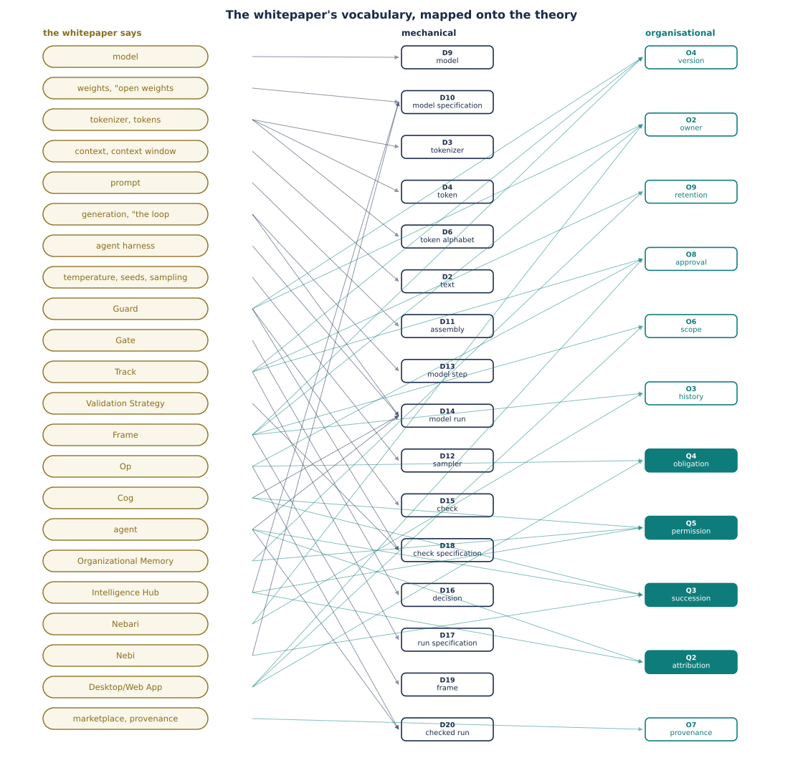

# The Whitepaper, Translated

A restatement of *The Distributed AI Economy* (Revision 9) in the vocabulary of two ledgers:
`definitions.md` — P1–P7, D1–D20, the machinery, with `examples.py` as its executable
companion — and `organisational-definitions.md` — Q1–Q5, O1–O9: persons, obligations,
history. Entries are cited as `D9[model]`, `Q2[attribution]`, `O2[owner]`; the paper's terms
are capitalized (Frame, Cog, Op) and are always the paper's, never the ledgers'.

**What "translated" means here.** Every load-bearing term of the paper is restated in the
vocabulary of the two ledgers — mechanical where the machinery carries it, organisational
where its content is persons, obligations, or history — or what neither holds is recorded
with the reason. The line between mechanical and organisational is drawn by construction — a
term sits where a definition could be built under the ledgers' rules — so where the line
falls is a result, not an opinion.

---

## 1. The dictionary

| the paper says | the mechanical ledger | the organisational ledger, or what neither holds |
| :--- | :--- | :--- |
| model | D9[model] | — |
| weights, "open weights" | part of a D10[model specification] | a specification determines a **set** of models, never one |
| tokenizer, tokens | D3[tokenizer], D4[token], D6[token alphabet] | the numbering and the decoder, both deferred with triggers |
| context, context window | a text over A with bound L; the window is L | "context" in the paper spans the carried texts, the assembled input, and the bound — three different things |
| prompt | a text in the sequence given to D11[assembly] | nothing mechanically separates it from a Frame's prose |
| generation, "the loop" | D13[model step], D14[model run] | the ledger's names guarantee less: a model is consulted; nothing requires the sampled symbol to survive the assembly |
| agent harness | the Given of D14[model run]: sampler, assembly, draws, stopping | — |
| temperature, seeds, sampling | D12[sampler] and its draws | randomness is in where draws come from; the functions are deterministic |
| Guard | D15[check]; shipped: D18[check specification] | version: O4[version]; owner: O2[owner]; when it runs belongs to the caller |
| Gate | D16[decision] | nothing mechanical distinguishes a verdict alphabet from an action alphabet |
| Track | D17[run specification] | pastness: O4[version]; keeping: O9[retention]; approvals: O8[approval]; cannot pin the model; verdicts deferred |
| Validation Strategy | D18[check specification] | the pre-flight/in-flight/post-run placement — a property of the caller |
| Frame | D19[frame] | scope: O6[scope]; owner: O2[owner]; versioning: O3[history], O4[version]; inheritance: O6 Notes; shareability and discoverability are conventions |
| Op | D20[checked run] | human roles: Q4[obligation], O8[approval]; tools, integration and the manifest format stay outside |
| Cog | D14[model run] plus carried texts | permissions: Q5[permission]; identity: Q3[succession]; tools stay outside |
| agent ("a Cog engaged through an Op") | D20 with a starting text | identity: a history with attributions (Q3[succession], Q2[attribution]); memory: texts or nothing (D14 Notes) |
| Organizational Memory | a source of texts for the assembly's sequence | retention: O9[retention]; access: Q5[permission]; governance and forgetting stay outside |
| Intelligence Hub | the site that picks which member of each specification's set runs (D10[model specification]) | custodian: keeps the carriers, seats the bindings — its registry rows evidence Q2[attribution], its access controls are Q5[permission] in carrier form |
| Nebari | a catalogue of specifications — texts determining sets of components | shared reading conventions for assembling Hubs; its packages have owners and histories (O2[owner], O3[history]) |
| Nebi | transport for specifications between Hubs; pinning shrinks the determined set, never to one (D10[model specification]) | the packaging format is a reading convention, codified; install logs are succession carriers (Q3[succession]) |
| Desktop/Web App | where starting texts enter and outputs return | the person–machinery surface: a click becomes an O8[approval], obligations reach the obliged (Q4[obligation]), scopes are experienced (O6[scope]) |
| marketplace, provenance | O7[provenance]: someone stands behind each version of a history | records of it are exchanged; the facts are bindings — see §4 |

---

## 2. The paper's claims, restated

Each claim is quoted from Revision 9, then read through the theory. "Sharpened" means the
theory says something more precise than the paper; "corrected" means the paper's sentence, read
mechanically, says something the machinery cannot deliver.

### 2.1 "behaves identically (within generative AI limits)" — §3.2, sharpened

The parenthesis is doing all the work, and the theory states exactly what it contains. By
D14[model run], a run is fixed by four things: the three components, the starting text, and the
draws. A shipped artifact can pin the starting text and the draws exactly, since both are
texts. It cannot pin the model: by D10[model specification], a text determines a *set* of
models, and the set is a singleton only if the number set and evaluation order are pinned too —
which no file carries, because they are properties of the machine (Clarification: hardware
arithmetic is exact; two evaluation orders are two functions, hence two models). So "identical
(within generative AI limits)" translates to: *identical starting text and draws, some member
of the same set of models*. The same limit applies to Guards (§2.7 below), which the paper does
not flag.

### 2.2 "A Frame is not a prompt" — §4.3, half corrected, half sharpened

Mechanically, the prose part of a Frame *is* a prompt. A text arrives at D11[assembly] carrying
its symbols and nothing else — no provenance, no authority — and for a concatenating assembly,
carrying `f` and receiving `t` produces the same input as receiving `f` followed by `t` typed
by hand. Installed and typed are extensionally the same.

What makes the sentence true is the paper's own §4.3 heading: *"One of the critical things that
Frames can do is define a Validation or Verification tool (a Guard) that must be called and
pass."* That is D19[frame]: a check specification that is itself a text over A — the one
artifact that both enters the model's input and declares what checks the output. The
declaration is read outside the loop, by the caller; that is what a prompt does not have.

**Consequence the paper should want:** a Frame that declares no Guard has no mechanical
content — it is a text like any other, and every one of its §4.3 properties is organisational: scoped is
O6[scope], owned is O2[owner], versioned is O3[history] with O4[version], inheritable is
O6's Notes; shareable and discoverable are conventions. The paper's Frames
divide into two kinds, and only one kind does anything the machinery can see.

### 2.3 Frames "orient" Cogs; the Cog "must respect" them — §4.3–4.4, corrected

A text cannot bind a model. D8[scoring] is total on A — every symbol receives a number
whatever the input says — so a text can shift every score and cannot remove a symbol from A;
exclusion, where it happens, is the sampler's act (D12), not the text's. "The Cog must follow
the Frame" is not a sentence the machinery can make true: obedience is score-mediated bias,
not constraint. Constraint exists in the architecture — it lives in D15[check] and
D20[checked run], outside the loop, where a failing output is refused or retried. This is not
only a criticism: it is the strongest available argument for why Guards must exist as separate
components. If Frames could bind, Guards would be redundant.

### 2.4 Boundaries, and prompt injection — §5.8, derived

D11[assembly] takes a *sequence* of texts and returns *one* text. A sequence records where
each text begins and ends; a single text does not. So any distinction among the assembled
texts — system against user, policy against data — survives only as delimiter symbols written
into the content, and content can contain those symbols. Prompt injection is therefore not an
implementation bug but a corollary of the assembly's type. The paper cites OWASP (§5.8); the
theory derives the vulnerability from one line: `asm : (A^*)^* → A^≤L`.

The same type explains why a Consensus Guard must receive outputs *before* assembly: in the
example system, ⟨aba′⟩-style sequences with different agreement verdicts assemble to the same
text, so no check on the assembled text can compute agreement (`examples.py` asserts this).
D15[check] takes a sequence of texts for exactly this reason.

### 2.5 "The harness is the loop; a Cog is what the loop ships as" — vocabulary table, confirmed

The paper's sentence translates exactly. The loop is D13[model step] iterated as
D14[model run]; what ships is the Given — model, sampler, assembly, carried texts — plus what
the ledger cannot express (tools, permissions). The three Cog types of §4.4 (model-heavy,
context-heavy, combined) are three ways of weighting the same Given: which of M and the
carried texts dominates the artifact. That is packaging, not structure — the theory sees one
kind of thing shipped three ways.

"A well-constructed Cog is, in large part, a well-managed context" (§4.4) translates to: the
Cog's useful degrees of freedom are the assembly and the carried texts — which is where
D11[assembly]'s Notes place everything that matters: what is kept, what is dropped, and what
order survives.

### 2.6 "Guards check. Gates decide." — §5.2, confirmed, then reduced

Confirmed as types: a Guard is `chk : (A^*)^* → V`, a Gate is `dec : V^* → C` — many things
reduced to one symbol, twice over, at two levels. The reduction the paper does not state:
nothing mechanical distinguishes V from C. Which alphabet holds verdicts and which holds
actions is fixed by position in the chain, not by any property of the alphabets.

The seven Gate actions of §5.2 — continue, pause, request human approval, escalate to an
expert, retry with a different Cog, run more validation, stop — reduce to **three mechanical
roles** (D20[checked run]): *continue* is the accept (the value stands), *stop* is the refuse
(no value, final), and the other five are *the next level* — another round, differing only in
who or what acts before it, a difference the function cannot see. The five are real, but they are organisational: each names whose obligation the action
triggers — pause the operator's, request-approval the approver's (its artifact O8[approval]),
escalation the expert's — Q4[obligation] doing the work the names suggest. In the example system this is
computed: `review` does nothing except let the recursion continue.

### 2.7 Guards "deterministic … probabilistic … human review" — §5.1, corrected

Three different things are being called one thing:

- A deterministic Guard is a check — but a *shipped* Guard is a D18[check specification], not
  a check, for the same two reasons a shipped model is a specification: it may use a model
  (§5.7 says some Guards are Cogs), and even a model-free implementation is underdetermined by
  evaluation order. **The marketplace's unit of exchange is a specification.** What §6.1 says
  of Frames — valuable "because of who stands behind it, not because of its code" — is
  therefore true of Guards for a mechanical reason, not only a commercial one.
- A probabilistic Guard is a deterministic check consuming a draw, exactly as D12[sampler]
  consumes one. Declaring the draw turns "probabilistic" from an unstateable property into a
  recordable input.
- A human is not a check at all. By P4[function], a check gives one verdict per input; a
  person does not. An Expert Guard is a *slot where a verdict enters from outside* — an input,
  like a draw, not a function. This is the honest mechanical reading of "human-in-the-loop":
  the human is data the Op consumes, and everything about *who* may supply that data is organisational: Q5[permission] says who may, and O8[approval] is the artifact supplied.

Regression and Drift Guards (§5.5) translate cleanly and usefully: a check's input is a
sequence of texts, and nothing requires those texts to come from one run — a drift check is a
check over outputs of many runs. The *time* part (which runs, how sampled) is organisational;
the comparison is D15[check] as it stands.

### 2.8 "an organization can reconstruct why a decision was made" — §5.3, corrected to *what*

A Track can hold what ran: by D17[run specification], it pins the starting text and the draws
exactly, and the components only as specifications (§2.1's limit). That reconstructs *what*
happened — and, if draws are recorded, allows replay up to the choice of model within the
specified set. "Why" is not in the machinery at all: a run has no state of its own (D14
Notes), nothing is carried between steps except the text, and the scoring's numbers are the
whole of the model's contribution. The theory's advice to the paper: claim *what*, and claim
it precisely — it is a strong claim, because texts pin texts exactly. Note also that a text
composed before the work and one composed after it are the same kind of object; a Track is a run
specification whose pastness is being an earlier item of a history (O4[version]) and whose
keeping is someone's duty (O9[retention]).

### 2.9 The lifecycle — §5.4, unified

Pre-flight, in-flight, post-run, continuous: one construction at different grains. Pre-flight
is a check on ⟨t⟩ before any round. Post-run is D20[checked run] as defined. In-flight is the
same wrap applied at D13[model step] grain instead of D14[model run]. Continuous is a check
whose input sequence spans runs (§2.7). The paper presents four stages; the theory presents
one operation and a choice of where to apply it — which is simpler to implement and simpler
to audit, since there is only one thing to get right.

### 2.10 "An agent, precisely, is a Cog engaged through an Op, given identity and memory by the Hub" — §4.2, translated with a hole named

The Cog-through-Op part translates: D20[checked run] with a starting text. The rest of the
sentence names the residue precisely: *identity* is not mechanical — nothing in the machinery distinguishes one
caller from another — but organisational: the continuing actor is a history of texts with
attributions (Q3[succession], Q2[attribution]); and *memory* is texts or it is
nothing — whatever an
agent "remembers" within a run is in the running text (and subject to D11's overflow); whatever
it remembers across runs enters the next run as part of the starting text, supplied from
outside. The paper's claim that whoever holds context, memory, and history owns the agent is
thus mechanically literal: the agent *is* its texts, plus functions anyone in possession of the
specifications can re-instantiate.

---

## 3. What the paper is about, seen from the theory

Strip the market framing and the paper adds one structure around the generation loop, in four moves, all of which the theory holds:

1. **Declare in advance, in text, what must hold** — D18[check specification], carried by
   D19[frame] when the declaration travels inside model input.
2. **Check the work against the declaration** — D15[check].
3. **Decide from the verdicts** — D16[decision].
4. **Record enough to fix what ran** — D17[run specification].

And the fifth move, which makes it an economy: the declarations and checks are themselves
texts, so they can be shipped. Every artifact in the paper is a file because only texts can be
exchanged, and the theory adds the caveat that gives the marketplace its real shape: **texts
determine functions only up to a set** (D10, D18). What a marketplace moves is specifications;
what runs in a Hub is members of the sets they determine.

The accountability plane, for all its vocabulary, is **two shapes**: many things reduced to
one symbol (check, decision), and a text that determines a set of functions (model, run, and
check specifications). Guards, Gates, Tracks, and Validation Strategies are four names for
two operations. That is a simplification the paper's authors can adopt, or refute by naming
the distinction the theory failed to see.

---

## 4. The residue, stated positively

Everything the machinery sees is a text, a function, or a number. Everything the paper adds is
about *people standing behind* texts and functions: who wrote a specification, who approved a
verdict's supplier, who may install which artifacts, who answers when the output is wrong.
Scope, inheritance, ownership, versioning, identity, retention, approval — none of these is mechanical, all for one reason: a text arrives carrying its
symbols and nothing else.

This is not the theory dismissing the paper. It is the theory locating the paper's actual
thesis. §6.1 says it in the paper's own words: *"When generation is free, provenance is the
product."* Provenance is precisely what the machinery cannot represent — which is why it
cannot be generated, why it cannot be faked by anything inside the loop, and why it can be the
product. The paper's business case rests on the residue being real and hard, and the theory confirms both.

What the theory adds to the thesis: since provenance is organisational, **every mechanism the
paper proposes for it (signing, versioning, marketplace vetting, accountable owners) must live
outside the loop and be verified outside the loop.** Anything that claims to carry provenance
*through* the model — a watermark in the text, a special Frame the model "respects" — is
refuted by D8's totality and D11's boundary loss before it is built.

The residue's ledger is `organisational-definitions.md`, under the same rules. Its
primitives are the bindings themselves: person, attribution, succession, obligation,
permission. Its definitions cover group, owner, history, version, delegation, scope,
approval, retention — and provenance, defined as *that someone stands behind each version of
a history*: bindings twice over, which makes the closing claim above a derivation — what a
marketplace moves is records claiming provenance; the records translate, the claimed facts
never do.

---

## 5. Testable claims

The translation makes the paper falsifiable in specific places. The
[audit](paper-vs-implementation-audit.md) reaches the same ground from the code side — its
§10 states the composability experiment these claims belong with. For any real Hub or the
reference implementations:

1. **Does the assembly distinguish installed context from typed context?** Under overflow, a
   position-aware assembly (always keep the first k symbols) can make a Frame's survival a
   guarantee; a plain concatenator cannot. If no assembly distinguishes them, Frame
   persistence is convention, not mechanism (§2.2).
2. **What fraction of published Frames declare a Guard?** Only those have mechanical content;
   the rest are prose riding on organisational properties (§2.2).
3. **Are draws recorded in Tracks?** Without them, replay is impossible even within D10's
   limit, and "reconstruct" means less than it appears to (§2.8).
4. **Is the numeric regime pinned anywhere** — number set, evaluation order, kernel versions?
   If not, "behaves identically" has no mechanical referent across Hubs (§2.1).
5. **Are Guard sequences ordered in manifests?** D18 requires the order to be declared, or
   the same Validation Strategy can yield different actions from the same verdicts (§2.6).
6. **Do Gate policies document who acts on each non-terminal action?** The five "next level"
   actions differ only there; if the *who* is undocumented, the seven-action vocabulary is
   decoration over three behaviours (§2.6).
7. **Where does a human verdict enter, and is it recorded as an input?** If expert review is
   implemented as "a Guard", the implementation contains a non-function and will not replay
   (§2.7).
8. **Which classes of texts must have non-empty owners, and where is that enforced?**
   Ownership is partial by design — most texts have no one standing behind them, and should
   not — so §4.3's *Owned* row and §6.1's "named, accountable owner" are a policy about the
   governed artifacts, not a property of texts (the organisational ledger's *owner*). The
   check: find the registry or equivalent carrier that makes the policy true, and the exact
   classes it covers.

---

## Appendix — section map

| paper § | content | status |
| :--- | :--- | :--- |
| Exec. summary, 1, 2 | problem, vision, market | organisational and market framing; no mechanical content to check |
| 3.1–3.3 | Nebari, Nebi, Hub | infrastructure — where functions run; §3.2's reproducibility claim: see §2.1 |
| 3.4 | Organizational Memory | a source of texts for assembly; governance is residue |
| 4.2 | Where Agents Fit | §2.10 |
| 4.3 | Frames | §2.2, §2.3 |
| 4.4 | Cogs | §2.5 |
| 4.5 | Ops | D20[checked run]; composition of Ops not yet in the theory |
| 5.1–5.3 | Guards, Gates, Tracks | §2.6–§2.8 |
| 5.4–5.6 | lifecycle, categories, strategy | §2.9, §2.7; the §5.6 manifest is a D18 with thresholds via D5/P5 |
| 5.7–5.8 | validation completes / open source | §2.4; "Guards as Cogs" feeds §2.7's specification point |
| 6 | marketplace | §3's fifth move; §4 |
| 7–11 | app, ecosystem, positioning, roadmap | organisational; no mechanical claims found |

*Not yet in the theory, recorded with triggers in `definitions.md`: probability distribution,
boolean/predicate, the decoder, token numbering, whether zero items is a sequence, arithmetic,
Op composition (§4.5's "Ops can invoke other Ops"), and a per-level record of a checked run (trigger in the mechanical ledger's log).*

---

## Figures

*Generated from the ledgers and the dictionary above by `../../tools/make_graphs.py`;
regenerated after any change to either.*
